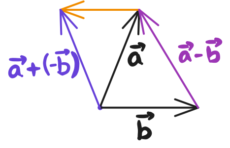

# Linear Algebra

Learning linear Algebra. The plan is to take notes and write sample code in python while learning.

To convert drawings to Latex, use the website [webdemo.myscript.com](https://webdemo.myscript.com/views/math/index.html)

- Encouraged to follow exercises from the website: [https://www.lem.ma/](https://www.lem.ma/)
- You can also download videos from the [first youtube Playlist](https://www.youtube.com/watch?list=PLlXfTHzgMRUKXD88IdzS14F4NxAZudSmv) to follow offline.
- [Youtube Channel](https://www.youtube.com/@MathTheBeautiful).
- The Professor is [Pavel GrinFeld](https://grinfeld.org/index.html).

List of playlists:
- [Part 1: Intro and Applications](https://www.youtube.com/playlist?list=PLlXfTHzgMRUKXD88IdzS14F4NxAZudSmv)
- [Part 2: Intro and Applications](https://www.youtube.com/playlist?list=PLlXfTHzgMRULWJYthculb2QWEiZOkwTSU)
- [Part 3: Linear Transformations](https://www.youtube.com/watch?list=PLlXfTHzgMRUIqYrutsFXCOmiqKUgOgGJ5)
- [Part 4: Inner Products](https://www.youtube.com/watch?v=Ww_aQqWZhz8&list=PLlXfTHzgMRULZfrNCrrJ7xDcTjGr633mm)

```bash
# brew install yt-dlp
playlistIds=(
    PLlXfTHzgMRUKXD88IdzS14F4NxAZudSmv
    PLlXfTHzgMRULWJYthculb2QWEiZOkwTSU
    PLlXfTHzgMRUIqYrutsFXCOmiqKUgOgGJ5
    PLlXfTHzgMRULZfrNCrrJ7xDcTjGr633mm
)
for playlistId in ${playlistIds[@]}; do
    yt-dlp -f bestvideo+bestaudio --merge-output-format mp4 -o "%(playlist)s/%(playlist_index)s-%(title)s.%(ext)s" --write-thumbnail --write-auto-sub --embed-subs --embed-metadata --embed-thumbnail "https://www.youtube.com/playlist?list=$playlistId"
done
```

---

## 1. Intro :  Eye vs Ear

- How our eyes perceive light vs how our ears perceive sound.
- Eye is very complex. Retina has 120 million rods and 6 million cones. The brain has to process all this information. Resolution of the eye is 576 megapixels, while the best monitors have 33 megapixels.
- Ear has a single sensor. Ear takes in the sum of all the sound waves. The brain processes this information. The ear has a resolution of 4000 bits per second, while the best microphones have 1000 bits per second.

---

## 2. Showcase : Approximating functions using Guassian Quadrature

**Approximating area under a curve**

Area under a curve can be approximated using rectangles, trapezoids, or Guassian Quadrature.

**Guassian Quadrature**

- Guassian Quadrature is a method for numerical integration. It is based on the idea that the integral of a function can be approximated by a weighted sum of the function at certain points. The weights and points are chosen in such a way that the approximation is extremely accurate.

This is related to linear algebra somehow 😅

---

## 3. Linear Addition of Sounds

- If a sound is simply an array of numbers, then adding two sounds is simply adding two arrays.
- If we add two sounds, we get a new sound that is the sum of the two sounds.

```py
bach + mlk # adding Bach and LMK speech
0.5*bach + mlk # adding half amplitude of Bach with LMK speech
```

---

## 4. Linear Decomposition

- Decomposition is not possible, in these examples:
  + I have some 5 rupee coins, some 10 rupee coins. Total is 100 rupees. How many 5 rupee coins and 10 rupee coins do I have? -> This has some finite number of solutions.
  + If count can be negative, then there are infinite solutions.
- For sound it is possible to decompose. We can decompose a sound into a sum of other sounds.
- In a situation, can we decompose? Classifications:
  + Decomposition is possible in a unique way.
  + Decomposition is not unique - infinite ways to decompose.
  + Decomposition is not possible - can't be decomposed.

---

## 5. The Three Fundamental Examples of Vectors

> Vectors are the kinds of objects that can be:
>   + Added together
>   + Multiplied by a number
>   
> To create an object of the same kind.

**Geometric Vectors**

- A geometric vector is a directed segment.
- Least abstract objects - since they are drawings.
- Much of inspiration and intuition in the world of linear algebra comes from geometric vectors.

**Polynomials**

- Polynomials are vectors.
- We can throw in sines, cosines, exponentials too. We can add two functions, and multiply a function by a number.
- Functions are vectors too!
- Polynomials is **a vector sub-space** of functions.

- Space of vectors is very useful to physicists.
- Mathematicians and physicists have a healthy obsession with exact mathemical expressions. They like to capture phenomena in the world with exact mathematical expressions.

**$\mathbb{R}^n$**

- $\mathbb{R}^n$ is the set of all n-tuples of real numbers.
- As abstract as it gets. When in everydya life do we encounter n-tuples of real numbers?

They are very important kinds of vectors:
1. The algorithms of linear algebra are stated, formulated, explored in $\mathbb{R}^n$.
2. Computers are particularly helpful if yyou can restate your problem in terms of sets of numbers.
3. All spaces look like $\mathbb{R}^n$.

By studying $\mathbb{R}^n$, we are studying all other kinds of vector spaces.

---

## 6. Geometric Vectors: Addition

> Typically, in introductory courses, we add a coordinate-system, and geometric vectors are defined as tip of the coordinates. Prof. Pavel (will refer to him as simply "Pavel", hereafter ☺️) encourages to give up the coordinate system, and just think of geometric vectors as directed segments floating in space.

- Suppose you want to go from a village O to a village R. The following pieces of information are not enough alone:
  + The distance from O to R. This reduces to a circle of possible locations.
  + The direction from O to R. This reduces to a ray of possible locations.

The displacement is captured by this directed segment. This is a geometric vector.

- We can add geometric vectors to denote the displacement from O to R, and then from R to S. This is the same as going from O to S.
- We can multiply a geometric vector by a number. Positive number means same direction, negative number means opposite direction. The magnitude of the vector is scaled by the number.
- When we add 2 vectors, the sum of the vectors lies in the same plane containing the 2 vectors.

---

## 7. Commutativity, Associativity, Distributivity for Geometric Vectors

$$
\begin{align*}
\text{Commutativity:} & \quad \vec{a} + \vec{b} = \vec{b} + \vec{a} \\
\text{Associativity:} & \quad (\vec{a} + \vec{b}) + \vec{c} = \vec{a} + (\vec{b} + \vec{c}) \\
\text{Distributivity:} & \quad \alpha(\vec{a} + \vec{b}) = \alpha\vec{a} + \alpha\vec{b}
\end{align*}
$$

- Associativity is a much more fundamental property than commutativity. Matrices are not commutative, but they are associative.
- 😅 Every operation that Pavel uses in his research are associative! That's how common associative properties are!
- How fundamental are these properties? (First is the more fundamental)
  + Associativity (most fundamental)
  + Commutativity
  + Distributivity (least fundamental)

All of them are about the order of operations not mattering:
- Commutativity: Order of the terms doesn't matter.
- Associativity: Order of the two addition operations doesn't matter.
- Distributivity: Order of the multiplation operation and the addition operation doesn't matter.


---

## 8. The Origin in the Plane and the Parallelogram Rule

Suppose, vectors all over the place:
- Some start at origin
- Some start at the tip of another vector
- Some seem to float in the plane wherever they want.

This is perfectly legitimate approach - vectors can be drawn anywhere as long as the length and direction of the vector is kept the same. However, linear algrebra takes a much cleaner approach for aesthetics and simplicity.

In linear algebra:
- We will choose a point that will be called the origin.
- We will only consider vectors that start at the origin.
- We might have to draw temporary constructions tosolve the problems, but once we find the answer, we will have to bring it back to the origin, because those are the only vectors which are part of the game.

Hence, the parallelogram rule which states that the sum of two vectors is the diagonal of the parallelogram formed by the two vectors.

- The parallelogram rule fails to be intuitively applicable in one dimentional geometric vectors! 😂 We cannot complete a parallelogram where the two vectors intersect.

---

## 9,10. Subtraction of Geometric Vectors

Two ways to do $\vec{a} - \vec{b}$:
1. $\vec{a} + (-\vec{b})$ : We can use the addition operation that we already know with $-\vec{b}$.
2. $\vec{a} - \vec{b}$ is such a vector that when added to $\vec{b}$ gives $\vec{a}$.



Subtraction is a piece of cake when vectors originate from the same point (origin) - Just draw from one tip to another tip.

However, addition results can have larger error because additional construction is involved.


---

## 11. What else works like Geometric Vectors?

We've used displacements or relative locations between points as our intuition for what Geometric Vectors represent. What else can be used as Geometric Vectors?

1. Displacements
2. Velocities
3. Accelerations
4. Forces

- The actions need not be sequential. They can be concurrent. Example:
  + A train is moving 60 miles per hour in the north direction.
  + A ladybug inside the train is moving 60 inches per hour (with respect to the train) in the east direction. <br/>
  Then, the two displacement vectors can be added to get the displacement of the ladybug with respect to the ground. <br/>
  Similar addition can be done for velocities and accelerations, and it can be derived algebraically from the displacement vectors.
- Force is different. For force vector, we have to believe in Newton's law $\vec{F} = m\vec{a}$. There is no way we can derive addition of forces without Newton's law. Possible explanations:
  + Since $\vec{a}$ is a vector, multiplication of mass (scalar) and acceleration, $m\vec{a}$, gives the force vector $\vec{F}$.
  + Why do forces add up to the parallelogram rule? Because Newton said so, and we don't know why! 🙏'
  + [Check discussions in the comment section.](https://www.youtube.com/watch?v=SPdqsGIAcXM&list=PLlXfTHzgMRUKXD88IdzS14F4NxAZudSmv&index=11)

---

## 12. Polynomials or Functions as Vectors

- Useful in numerical analysis.
- Complex phenomena or problems can be represented as polynomial functions.
- Now, while talking about polynomials, do two quadratic polynomials add up to a quadratic polynomial? No necessarily - the higher degree terms might cancel out. Even, we can multiply by 0 to get the zero polynomial. <br/>
  Hence, **terminology needs to fixed**: we cannot say n-degree polynomials, rather **polynomials upto degree n.**

Similar to how the linear combination of two geometric vectors are stuck in the plane containing the two vectors, the linear combination of two polynomials having a root as K will also have K as a root.

---

## 13. Is one polynomial a multiple of another?

$$
\begin{align*}
p(x) &= x + 1 \\
q(x) &= x^2 + x \\
\end{align*}
$$

Is $p(x)$ a multiple of $q(x)$? IIf we are not looking into the vector aspect, then yes. However, when we are considering polynomial as vectors, then only scalar multiples are allowed, we cannot multiply by `x`, which is not a scalar value (number).

---

## 14. $\mathbb{R}^n$ as Vectors

Addition:

$$
\begin{bmatrix} 1 \\ 2 \\ 3 \end{bmatrix} +
\begin{bmatrix} -2 \\ 7 \\ -6 \end{bmatrix} =
\begin{bmatrix} -1 \\ 9 \\ -3 \end{bmatrix}
$$

Scalar multiplication:

$$
7 \times \begin{bmatrix} 4 \\ 0 \\ 12 \end{bmatrix} =
\begin{bmatrix} 28 \\ 0 \\ 84 \end{bmatrix}
$$

Stuck in a plane:
- In each of the vectors in LHS, the third entry is 3 times the first entry. By any linear combination (multiplication by a scalar or addition), we will always be stuck with vectors having the same property.
- By goemetric analogy, this is called a subspace of $\mathbb{R}^3$.

😅 There is no linkage between $\mathbb{R}^3$ and a plane, which is a term from geometry - other than both being vectors.

---

## 15. Linear Combinations

- We have two vectors $\vec{a}$ and $\vec{b}$.
- We can multiply by different numbers and add them: $\alpha\vec{a} + \beta\vec{b}$. $\alpha$ and $\beta$ are called coefficients of the linear combination.
- That stuck terminology can be conveniently said: **You are stuck in this plane under linear combinations**.

---

## 16. Examples of Linear Combinations

- For each of the types of vectors (geometric, polynomial, $\mathbb{R}^n$), we can take linear combinations.
- For polynomials, intriguing question:
  + $a(x) = x^2 + 1$, $b(x) = 3x^2 - 3x - 6$. For any $\alpha$ and $\beta$, does $c(x) = \alpha a(x) + \beta b(x)$ have the same property that $x = 2$ is a solution?
  + Is another property $f(2) = 1$ preserved under linear combinations?
- For matrices, similar questions can be asked:
  + $a = \begin{bmatrix} 1 \\ 2 \\ 0 \end{bmatrix}$, $b = \begin{bmatrix} -2 \\ 4 \\ 0 \end{bmatrix}$. For any $\alpha$ and $\beta$, does $c = \alpha a + \beta b$ have the same property that $c_3 = 0$, $c_3 = 1$?
  + $c_3 = -c_1$ -> will this be preserved?

Personal Thought: The 0 values always look to be honoured; so $c_3 = 0$ should preserved in the linear combination of $a$ and $b$. Similarly, the roots of the equation should be preserved. But some property like $f(2) = 1$ or $c_3 = 1$ should not be preserved under every linear combination. <br/>
Properties like $c_3 = -c_1$ should also be preserved too under linear combination - because the proportion is maintained.

---

## 17. The Zero Vector

The zero vector:
- Geometric vector: A vector with 0 length, denoted using a dot, with an arrow pointing anywhere : $\vec{\mathbf{0}}$.
- Polynomial: The zero polynomial. The 0 can be made bold: $\mathbf{0}$.
- $\mathbb{R}^n$: The vector with all entries as 0: In $\mathbb{R}^3$ it is $\begin{bmatrix} 0 \\ 0 \\ 0 \end{bmatrix}$, also denoted as $\mathbf{0}$.

---

## 18. Span the Man

- The set of all possible linear combinations of a set of vectors is called the span of the set of vectors.
- Example, $span(a, b) = \{ \alpha a + \beta b ; \alpha, \beta \in \mathbb{R} \}$.
- The span of a set of vectors is a subspace of the space containing the vectors.

__Question__: Is the span of the vectors $a = \begin{bmatrix} 1 \\ 0 \\ 2 \end{bmatrix}$ and $b = \begin{bmatrix} 7 \\ 0 \\ 15 \end{bmatrix}$ all of $\mathbb{R}^3$, or a proper subspace of $\mathbb{R}^3$?

__Answer__: We can see middle entry is always 0. So, the span of these vectors cannot have any vector with non-zero middle entry. Hence, it is a proper subspace of $\mathbb{R}^3$.

---

## 19. Spanning Sets

A spanning set is a set of vectors whose span is the entire space.

$$
\begin{aligned}
a(x) &= 3x^2 + 5x - 8 \\
b(x) &= -x^2 + 3x - 2
\end{aligned}
$$

- Does $a(x)$ and $b(x)$ span all polynomials of degree 2?

  Nopes, because 1 is root of both $a(x)$ and $b(x)$, but some polynomials of degree 2 might not have 1 as root.
- Does $a(x)$ and $b(x)$ span all polynomials having root 1?
  We'll need to investigate this.

---

## 20. Linear Subspaces of the Plane

- We go through some examples of sets of vectors, and answer if those sets form the spanning set for the defined space.

---

## 21. An interesting exercise of Linear Combination

Consider, two vectors $\vec{a}$ and $\vec{b}$. We do linear combination, $\alpha\vec{a} + \beta\vec{b}$, with the constraint that $\alpha + \beta = 1$. What is the span of the set of vectors?

- By construction of locus from sample points, we observe that it is the line passing through the tip of the two vectors.
- Formally, using algebra: $\beta = 1 - \alpha$, so $\alpha\vec{a} + \beta\vec{b} = \alpha\vec{a} + (1 - \alpha)\vec{b} = \vec{b} + \alpha(\vec{a} - \vec{b})$.<br/>
  This tell us we always start at the tip of $\vec{b}$ and slide along the line connecting the tips of $\vec{a}$ and $\vec{b}$.

---

## 22. Equation of a straight line


---

## 23. Passionate Appeal - Treat all objects on their own terms.

- Don't intermix the world of geometric vectors with the world of polynomials or $\mathbb{R}^n$.

---

## 24. Summary of terms encountered so far

1. Vector
2. Linear Combination
3. Decomposition
4. Vector space and Linear space -> Closure

---

# 29. Decomposition


---

# 30. Decomposition wrt arbitrary vectors


- This looks like a skewed cartesian coordinate system. It's called __Affine grid__.

[chatgpt conversation](https://chatgpt.com/share/67d2a5c8-61cc-8009-979a-53f96dc1b353)

---

