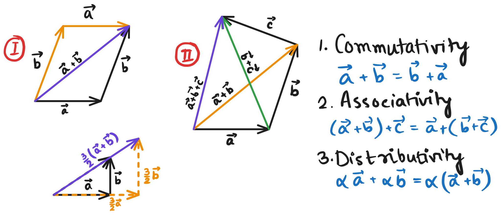
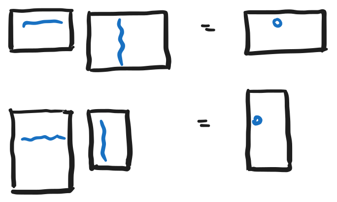

# Linear Algebra

Learning linear Algebra. The plan is to take notes and write sample code in python while learning.

To convert drawings to Latex, use the website [webdemo.myscript.com](https://webdemo.myscript.com/views/math/index.html)

- Encouraged to follow exercises from the website: [https://www.lem.ma/](https://www.lem.ma/)
- You can also download videos from the [first youtube Playlist](https://www.youtube.com/watch?list=PLlXfTHzgMRUKXD88IdzS14F4NxAZudSmv) to follow offline.
- [Youtube Channel](https://www.youtube.com/@MathTheBeautiful).
- The Professor is [Pavel GrinFeld](https://grinfeld.org/index.html).

List of playlists:
- [Part 1: Intro and Applications](https://www.youtube.com/playlist?list=PLlXfTHzgMRUKXD88IdzS14F4NxAZudSmv)
- [Part 2: Intro and Applications](https://www.youtube.com/playlist?list=PLlXfTHzgMRULWJYthculb2QWEiZOkwTSU)
- [Part 3: Linear Transformations](https://www.youtube.com/watch?list=PLlXfTHzgMRUIqYrutsFXCOmiqKUgOgGJ5)
- [Part 4: Inner Products](https://www.youtube.com/watch?v=Ww_aQqWZhz8&list=PLlXfTHzgMRULZfrNCrrJ7xDcTjGr633mm)

```bash
# brew install yt-dlp
playlistIds=(
    PLlXfTHzgMRUKXD88IdzS14F4NxAZudSmv
    PLlXfTHzgMRULWJYthculb2QWEiZOkwTSU
    PLlXfTHzgMRUIqYrutsFXCOmiqKUgOgGJ5
    PLlXfTHzgMRULZfrNCrrJ7xDcTjGr633mm
)
for playlistId in ${playlistIds[@]}; do
    yt-dlp -f bestvideo+bestaudio --merge-output-format mp4 -o "%(playlist)s/%(playlist_index)s-%(title)s.%(ext)s" --write-thumbnail --write-auto-sub --embed-subs --embed-metadata --embed-thumbnail "https://www.youtube.com/playlist?list=$playlistId"
done
```

---

## 1. Intro :  Eye vs Ear

- How our eyes perceive light vs how our ears perceive sound.
- Eye is very complex. Retina has 120 million rods and 6 million cones. The brain has to process all this information. Resolution of the eye is 576 megapixels, while the best monitors have 33 megapixels.
- Ear has a single sensor. Ear takes in the sum of all the sound waves. The brain processes this information. The ear has a resolution of 4000 bits per second, while the best microphones have 1000 bits per second.

---

## 2. Showcase : Approximating functions using Guassian Quadrature

**Approximating area under a curve**

Area under a curve can be approximated using rectangles, trapezoids, or Guassian Quadrature.

**Guassian Quadrature**

- Guassian Quadrature is a method for numerical integration. It is based on the idea that the integral of a function can be approximated by a weighted sum of the function at certain points. The weights and points are chosen in such a way that the approximation is extremely accurate.

This is related to linear algebra somehow 😅

---

## 3. Linear Addition of Sounds

- If a sound is simply an array of numbers, then adding two sounds is simply adding two arrays.
- If we add two sounds, we get a new sound that is the sum of the two sounds.

```py
bach + mlk # adding Bach and LMK speech
0.5*bach + mlk # adding half amplitude of Bach with LMK speech
```

---

## 4. Linear Decomposition

- Decomposition is not possible, in these examples:
  + I have some 5 rupee coins, some 10 rupee coins. Total is 100 rupees. How many 5 rupee coins and 10 rupee coins do I have? -> This has some finite number of solutions.
  + If count can be negative, then there are infinite solutions.
- For sound it is possible to decompose. We can decompose a sound into a sum of other sounds.
- In a situation, can we decompose? Classifications:
  + Decomposition is possible in a unique way.
  + Decomposition is not unique - infinite ways to decompose.
  + Decomposition is not possible - can't be decomposed.

---

## 5. The Three Fundamental Examples of Vectors

> Vectors are the kinds of objects that can be:
>   + Added together
>   + Multiplied by a number
>   
> To create an object of the same kind.

**Geometric Vectors**

- A geometric vector is a directed segment.
- Least abstract objects - since they are drawings.
- Much of inspiration and intuition in the world of linear algebra comes from geometric vectors.

**Polynomials**

- Polynomials are vectors.
- We can throw in sines, cosines, exponentials too. We can add two functions, and multiply a function by a number.
- Functions are vectors too!
- Polynomials is **a vector sub-space** of functions.

- Space of vectors is very useful to physicists.
- Mathematicians and physicists have a healthy obsession with exact mathemical expressions. They like to capture phenomena in the world with exact mathematical expressions.

**$\mathbb{R}^n$**

- $\mathbb{R}^n$ is the set of all n-tuples of real numbers.
- As abstract as it gets. When in everydya life do we encounter n-tuples of real numbers?

They are very important kinds of vectors:
1. The algorithms of linear algebra are stated, formulated, explored in $\mathbb{R}^n$.
2. Computers are particularly helpful if yyou can restate your problem in terms of sets of numbers.
3. All spaces look like $\mathbb{R}^n$.

By studying $\mathbb{R}^n$, we are studying all other kinds of vector spaces.

---

## 6. Geometric Vectors: Addition

> Typically, in introductory courses, we add a coordinate-system, and geometric vectors are defined as tip of the coordinates. Prof. Pavel (will refer to him as simply "Pavel", hereafter ☺️) encourages to give up the coordinate system, and just think of geometric vectors as directed segments floating in space.

- Suppose you want to go from a village O to a village R. The following pieces of information are not enough alone:
  + The distance from O to R. This reduces to a circle of possible locations.
  + The direction from O to R. This reduces to a ray of possible locations.

The displacement is captured by this directed segment. This is a geometric vector.

- We can add geometric vectors to denote the displacement from O to R, and then from R to S. This is the same as going from O to S.
- We can multiply a geometric vector by a number. Positive number means same direction, negative number means opposite direction. The magnitude of the vector is scaled by the number.
- When we add 2 vectors, the sum of the vectors lies in the same plane containing the 2 vectors.

---

## 7. Commutativity, Associativity, Distributivity for Geometric Vectors

$$
\begin{align*}
\text{Commutativity:} & \quad \vec{a} + \vec{b} = \vec{b} + \vec{a} \\
\text{Associativity:} & \quad (\vec{a} + \vec{b}) + \vec{c} = \vec{a} + (\vec{b} + \vec{c}) \\
\text{Distributivity:} & \quad \alpha(\vec{a} + \vec{b}) = \alpha\vec{a} + \alpha\vec{b}
\end{align*}
$$

- Associativity is a much more fundamental property than commutativity. Matrices are not commutative, but they are associative.
- 😅 Every operation that Pavel uses in his research are associative! That's how common associative properties are!
- How fundamental are these properties? (First is the more fundamental)
  + Associativity (most fundamental)
  + Commutativity
  + Distributivity (least fundamental)

All of them are about the order of operations not mattering:
- Commutativity: Order of the terms doesn't matter.
- Associativity: Order of the two addition operations doesn't matter.
- Distributivity: Order of the multiplation operation and the addition operation doesn't matter.



---

## 8. The Origin in the Plane and the Parallelogram Rule

Suppose, vectors all over the place:
- Some start at origin
- Some start at the tip of another vector
- Some seem to float in the plane wherever they want.

This is perfectly legitimate approach - vectors can be drawn anywhere as long as the length and direction of the vector is kept the same. However, linear algrebra takes a much cleaner approach for aesthetics and simplicity.

In linear algebra:
- We will choose a point that will be called the origin.
- We will only consider vectors that start at the origin.
- We might have to draw temporary constructions tosolve the problems, but once we find the answer, we will have to bring it back to the origin, because those are the only vectors which are part of the game.

Hence, the parallelogram rule which states that the sum of two vectors is the diagonal of the parallelogram formed by the two vectors.

- The parallelogram rule fails to be intuitively applicable in one dimentional geometric vectors! 😂 We cannot complete a parallelogram where the two vectors intersect.

---

## 9,10. Subtraction of Geometric Vectors

Two ways to do $\vec{a} - \vec{b}$:
1. $\vec{a} + (-\vec{b})$ : We can use the addition operation that we already know with $-\vec{b}$.
2. $\vec{a} - \vec{b}$ is such a vector that when added to $\vec{b}$ gives $\vec{a}$.


Subtraction is a piece of cake when vectors originate from the same point (origin) - Just draw from one tip to another tip.

However, addition results can have larger error because additional construction is involved.


---

## 11. What else works like Geometric Vectors?

We've used displacements or relative locations between points as our intuition for what Geometric Vectors represent. What else can be used as Geometric Vectors?

1. Displacements
2. Velocities
3. Accelerations
4. Forces

- The actions need not be sequential. They can be concurrent. Example:
  + A train is moving 60 miles per hour in the north direction.
  + A ladybug inside the train is moving 60 inches per hour (with respect to the train) in the east direction. <br/>
  Then, the two displacement vectors can be added to get the displacement of the ladybug with respect to the ground. <br/>
  Similar addition can be done for velocities and accelerations, and it can be derived algebraically from the displacement vectors.
- Force is different. For force vector, we have to believe in Newton's law $\vec{F} = m\vec{a}$. There is no way we can derive addition of forces without Newton's law. Possible explanations:
  + Since $\vec{a}$ is a vector, multiplication of mass (scalar) and acceleration, $m\vec{a}$, gives the force vector $\vec{F}$.
  + Why do forces add up to the parallelogram rule? Because Newton said so, and we don't know why! 🙏'
  + [Check discussions in the comment section.](https://www.youtube.com/watch?v=SPdqsGIAcXM&list=PLlXfTHzgMRUKXD88IdzS14F4NxAZudSmv&index=11)

---

## 12. Polynomials or Functions as Vectors

- Useful in numerical analysis.
- Complex phenomena or problems can be represented as polynomial functions.
- Now, while talking about polynomials, do two quadratic polynomials add up to a quadratic polynomial? No necessarily - the higher degree terms might cancel out. Even, we can multiply by 0 to get the zero polynomial. <br/>
  Hence, **terminology needs to fixed**: we cannot say n-degree polynomials, rather **polynomials upto degree n.**

Similar to how the linear combination of two geometric vectors are stuck in the plane containing the two vectors, the linear combination of two polynomials having a root as K will also have K as a root.

---

## 13. Is one polynomial a multiple of another?

$$
\begin{align*}
p(x) &= x + 1 \\
q(x) &= x^2 + x \\
\end{align*}
$$

Is $p(x)$ a multiple of $q(x)$? IIf we are not looking into the vector aspect, then yes. However, when we are considering polynomial as vectors, then only scalar multiples are allowed, we cannot multiply by `x`, which is not a scalar value (number).

---

## 14. $\mathbb{R}^n$ as Vectors

Addition:

$$
\begin{bmatrix} 1 \\\ 2 \\\ 3 \end{bmatrix} +
\begin{bmatrix} -2 \\\ 7 \\\ -6 \end{bmatrix} =
\begin{bmatrix} -1 \\\ 9 \\\ -3 \end{bmatrix}
$$

Scalar multiplication:

$$
7 \times \begin{bmatrix} 4 \\\ 0 \\\ 12 \end{bmatrix} =
\begin{bmatrix} 28 \\\ 0 \\\ 84 \end{bmatrix}
$$

Stuck in a plane:
- In each of the vectors in LHS, the third entry is 3 times the first entry. By any linear combination (multiplication by a scalar or addition), we will always be stuck with vectors having the same property.
- By goemetric analogy, this is called a subspace of $\mathbb{R}^3$.

😅 There is no linkage between $\mathbb{R}^3$ and a plane, which is a term from geometry - other than both being vectors.

---

## 15. Linear Combinations

- We have two vectors $\vec{a}$ and $\vec{b}$.
- We can multiply by different numbers and add them: $\alpha\vec{a} + \beta\vec{b}$. $\alpha$ and $\beta$ are called coefficients of the linear combination.
- That stuck terminology can be conveniently said: **You are stuck in this plane under linear combinations**.

---

## 16. Examples of Linear Combinations

- For each of the types of vectors (geometric, polynomial, $\mathbb{R}^n$), we can take linear combinations.
- For polynomials, intriguing question:
  + $a(x) = x^2 + 1$, $b(x) = 3x^2 - 3x - 6$. For any $\alpha$ and $\beta$, does $c(x) = \alpha a(x) + \beta b(x)$ have the same property that $x = 2$ is a solution?
  + Is another property $f(2) = 1$ preserved under linear combinations?
- For matrices, similar questions can be asked:
  + Given matrices $a$ and $b$, , does $c = \alpha a + \beta b$ have the same property that $c_3 = 0$ or the property $c_3 = 1$?
  + $c_3 = -c_1$ -> will this be preserved?

$$
a = \begin{bmatrix} 1 \\\ 2 \\\ 0 \end{bmatrix}, \quad
b = \begin{bmatrix} -2 \\\ 4 \\\ 0 \end{bmatrix}
$$

Personal Thought: The 0 values always look to be honoured; so $c_3 = 0$ should preserved in the linear combination of $a$ and $b$. Similarly, the roots of the equation should be preserved. But some property like $f(2) = 1$ or $c_3 = 1$ should not be preserved under every linear combination. <br/>
Properties like $c_3 = -c_1$ should also be preserved too under linear combination - because the proportion is maintained.

---

## 17. The Zero Vector

The zero vector:
- Geometric vector: A vector with 0 length, denoted using a dot, with an arrow pointing anywhere : $\vec{\mathbf{0}}$.
- Polynomial: The zero polynomial. The 0 can be made bold: $\mathbf{0}$.
- $\mathbb{R}^n$: The vector with all entries as 0: In $\mathbb{R}^3$ it is the below matrix, also denoted as $\mathbf{0}$.

$$\begin{bmatrix} 0 \\\ 0 \\\ 0 \end{bmatrix}$$


---

## 18. Span the Man

- The set of all possible linear combinations of a set of vectors is called the span of the set of vectors.
- Example, $span(a, b) = \{ \alpha a + \beta b ; \alpha, \beta \in \mathbb{R} \}$.
- The span of a set of vectors is a subspace of the space containing the vectors.

__Question__: Is the span of the vectors $a$ and $b$ all of $\mathbb{R}^3$, or a proper subspace of $\mathbb{R}^3$? 

$$
a = \begin{bmatrix} 1 \\\ 0 \\\ 2 \end{bmatrix}, \quad
b = \begin{bmatrix} 7 \\\ 0 \\\ 15 \end{bmatrix}
$$

__Answer__: We can see middle entry is always 0. So, the span of these vectors cannot have any vector with non-zero middle entry. Hence, it is a proper subspace of $\mathbb{R}^3$.

---

## 19. Spanning Sets

A spanning set is a set of vectors whose span is the entire space.

$$
\begin{aligned}
a(x) &= 3x^2 + 5x - 8 \\
b(x) &= -x^2 + 3x - 2
\end{aligned}
$$

- Does $a(x)$ and $b(x)$ span all polynomials of degree 2?

  Nopes, because 1 is root of both $a(x)$ and $b(x)$, but some polynomials of degree 2 might not have 1 as root.
- Does $a(x)$ and $b(x)$ span all polynomials having root 1?
  We'll need to investigate this.

---

## 20. Linear Subspaces of the Plane

- We go through some examples of sets of vectors, and answer if those sets form the spanning set for the defined space.

---

## 21. An interesting exercise of Linear Combination

Consider, two vectors $\vec{a}$ and $\vec{b}$. We do linear combination, $\alpha\vec{a} + \beta\vec{b}$, with the constraint that $\alpha + \beta = 1$. What is the span of the set of vectors?

- By construction of locus from sample points, we observe that it is the line passing through the tip of the two vectors.
- Formally, using algebra: $\beta = 1 - \alpha$, so $\alpha\vec{a} + \beta\vec{b} = \alpha\vec{a} + (1 - \alpha)\vec{b} = \vec{b} + \alpha(\vec{a} - \vec{b})$.<br/>
  This tell us we always start at the tip of $\vec{b}$ and slide along the line connecting the tips of $\vec{a}$ and $\vec{b}$.

---

## 22. Equation of a straight line


---

## 23. Passionate Appeal - Treat all objects on their own terms.

- Don't intermix the world of geometric vectors with the world of polynomials or $\mathbb{R}^n$.

---

## 24. Summary of terms encountered so far

1. Vector
2. Linear Combination
3. Decomposition
4. Vector space and Linear space -> Closure

---

## 29. Decomposition


---

## 30. Decomposition wrt arbitrary vectors


- This looks like a skewed cartesian coordinate system. It's called __Affine grid__.

[chatgpt conversation](https://chatgpt.com/share/67d2a5c8-61cc-8009-979a-53f96dc1b353)

---

## 32. Decomposition with polynomials 2

$$
p_1(x) = 1, p_2(x) = x + 2, p_3(x) = x^2 + x - 3
$$

$$
x^2 + 7x + 5 = \alpha _1 p_1(x) + \beta _1 p_2(x) + \gamma _1 p_3(x) \\
x^2 - 7x = \alpha _2 p_1(x) + \beta _2 p_2(x) + \gamma _2 p_3(x)
$$


---

## 33. Decomposition with $\mathbb{R}^n$

Let:

$$
a = \begin{bmatrix} 1 \\\ 0 \\\ 0 \end{bmatrix}, \quad
b = \begin{bmatrix} 0 \\\ 1 \\\ 0 \end{bmatrix}, \quad
c = \begin{bmatrix} 0 \\\ 0 \\\ 1 \end{bmatrix}
$$

We have:

$$
\begin{bmatrix} 3 \\\ 5 \\\ 6 \end{bmatrix}
= 3a + 5b + 6c
$$

$$
\begin{bmatrix} 8 \\\ -11 \\\ 17 \end{bmatrix}
= 8 a + (-11) b + 17 c
$$

---

## 35. Decomposition with $\mathbb{R}^n$ 3

Let:

$$
a = \begin{bmatrix} 0 \\\ 0 \\\ 1 \end{bmatrix}, \quad
b = \begin{bmatrix} 0 \\\ 1 \\\ -1 \end{bmatrix}, \quad
c = \begin{bmatrix} 1 \\\ 2 \\\ 3 \end{bmatrix}
$$

We have:

$$
\begin{bmatrix} 3 \\\ 5 \\\ 6 \end{bmatrix}
= \rule{1em}{0.8pt} a + \rule{1em}{0.8pt} b + \rule{1em}{0.8pt} c
$$

$$
\begin{bmatrix} 8 \\\ -11 \\\ 17 \end{bmatrix}
= \rule{1em}{0.8pt} a + \rule{1em}{0.8pt} b + \rule{1em}{0.8pt} c
$$

---

## 36. Linear Systems are a Decomposition Problem

The system of equations:

$$
x + 2y + 3z + 3t = 12
$$

$$
4x + 5y + 6z + 3t = 45
$$

$$
7x + 8y + 9z + 3t = 78
$$

can be written in matrix form as:

$$
\begin{bmatrix} 12 \\\ 45 \\\ 78 \end{bmatrix} =
x \begin{bmatrix} 1 \\\ 4 \\\ 7 \end{bmatrix} +
y \begin{bmatrix} 2 \\\ 5 \\\ 8 \end{bmatrix} +
z \begin{bmatrix} 3 \\\ 6 \\\ 9 \end{bmatrix} +
t \begin{bmatrix} 3 \\\ 3 \\\ 3 \end{bmatrix}
$$

---

## 37. Impossible Decomposition

Wordings:

- The decomposition problem does not have a solution if the target vector does not lie in the subspace spanned by the decomposition vectors.
- The decomposition problem does not have a solution if the target vector is not within the span of the decomposition vectors.

---

## 38. Impossible Decomposition with Polynomials

The given equations are:

$$
X^2 + 1 = \rule{1em}{0.8pt} (X^2 + X) + \rule{1em}{0.8pt} (3X^2 - 11X) + \rule{1em}{0.8pt} (7X^2 - X)
$$

$$
X^2 + 1 = \rule{1em}{0.8pt} (X - 1) + \rule{1em}{0.8pt} (X^2 - 1) + \rule{1em}{0.8pt} (X^2 - 2X + 1)
$$

$$
X^2 + 1 = \rule{1em}{0.8pt} (X^2 - 4) + \rule{1em}{0.8pt} (3X - 6) + \rule{1em}{0.8pt} (X^2 - 4X + 4)
$$

1. RHS in the first equation does not have any polynomial with constant terms, so we can't get constant in LHS.
2. RHS in the second equation have all polynomials having coefficients adding up to 0 (i.e., 1 is a root). But the polynomial in LHS does not have 1 as a root.
3. RHS in the third equation have 2 as a root, but the polynomial in LHS does not have 2 as a root.

Thus, the polynomial in LHS is not in the subspace of the polynomials spanned by the decomposition polynomials / vectors.

---

## 39. Impossible Decomposition in $\mathbb{R}^n$

The given vector equations are:

$$
\begin{bmatrix} 3 \\\ 4 \\\ 7 \end{bmatrix} = \rule{1em}{0.8pt} \begin{bmatrix} 1 \\\ 0 \\\ 2 \end{bmatrix} + \rule{1em}{0.8pt} \begin{bmatrix} -7 \\\ 0 \\\ 5 \end{bmatrix} + \rule{1em}{0.8pt} \begin{bmatrix} 4 \\\ 0 \\\ 11 \end{bmatrix}
$$

$$
\begin{bmatrix} 3 \\\ 4 \\\ 7 \end{bmatrix} = \rule{1em}{0.8pt} \begin{bmatrix} 3 \\\ 15 \\\ 7 \end{bmatrix} + \rule{1em}{0.8pt} \begin{bmatrix} -4 \\\ -20 \\\ 3 \end{bmatrix} + \rule{1em}{0.8pt} \begin{bmatrix} 1 \\\ 5 \\\ 17 \end{bmatrix}
$$

$$
\begin{bmatrix} 3 \\\ 4 \\\ 7 \end{bmatrix} = \rule{1em}{0.8pt} \begin{bmatrix} 1 \\\ 2 \\\ 3 \end{bmatrix} + \rule{1em}{0.8pt} \begin{bmatrix} 4 \\\ 5 \\\ 6 \end{bmatrix} + \rule{1em}{0.8pt} \begin{bmatrix} 7 \\\ 8 \\\ 9 \end{bmatrix}
$$

1. Second entry cannot be made non-zero by a linear combination of the given vectors.
2. Second entry is 5 times first entry in all the decomposition vectors, but the target vector does not have this property.
3. Second entry is average of first and third entry in all the decomposition vectors, but the target vector does not have this property.

The properties which we identified remain preserved under addition and scalar multiplication - you can try out a few examples to verify this.

---

## 40. What is a Linear Property and Why it is Synonymous with Subspaces

__Linear property is synonymous with the noun subspace.__

A __subspace__ is a subset of a vector space that is a vector space in its own right. In other words, a subspace is a subset of a vector space that is closed under linear combination.

---

## 41. A property Irrelevant to Linear Combinations

Some properties are irrelevant to linear combinations. For example:
- divisible by 2, 3 or any number
- some value is constant (not equal to 0).

These properties are not linear properties because they are not preserved under linear combinations.

---

## 42. Linear Subspaces in $\mathbb{R}^n$

$$
\begin{bmatrix} 1 \\\ 0 \\\ 2 \end{bmatrix} \quad
\begin{bmatrix} -7 \\\ 0 \\\ 5 \end{bmatrix} \quad
\begin{bmatrix} 4 \\\ 0 \\\ 11 \end{bmatrix}
$$

$$
\begin{bmatrix} 3 \\\ 15 \\\ 7 \end{bmatrix} \quad
\begin{bmatrix} -4 \\\ -20 \\\ 3 \end{bmatrix} \quad
\begin{bmatrix} 1 \\\ 5 \\\ 17 \end{bmatrix}
$$

$$
\begin{bmatrix} 1 \\\ 2 \\\ 3  \end{bmatrix} \quad
\begin{bmatrix} 4 \\\ 5 \\\ 6 \end{bmatrix} \quad
\begin{bmatrix} 7 \\\ 8 \\\ 9 \end{bmatrix}
$$

If the vector entries are named as following:

$$
\begin{bmatrix} a \\\ b \\\ c \end{bmatrix}
$$

Then, the algebraic expression corresponding to the properties of the vectors are:
1. $b = 0$
2. $b = 5a$
3. $b = \frac{a + c}{2}$

Or, equivalently:
1. $b = 0$
2. $5a - b = 0$
3. $a - 2b + c = 0$

These algebraic expressions all follow the same template: __A linear combination of the coefficients of the entries of the vectors = 0.__

__Any subspace can be characterized by just a triplet of coefficients.__

1. $(0, 1, 0)$ - The subspace of vectors with second entry 0.
2. $(5, -1, 0)$ - The subspace of vectors with second entry 5 times the first entry.
3. $(1, -2, 1)$ - The subspace of vectors with second entry being the average of the first and third entry.

__This is exactly the requirement for linear properties. Any characteristic that cannot be written down in this format is not a linear property.__

$$
\begin{bmatrix} 1 \\\ 0 \\\ 3 \end{bmatrix} \quad
\begin{bmatrix} -7 \\\ 0 \\\ -21 \end{bmatrix} \quad
\begin{bmatrix} 4 \\\ 0 \\\ 12 \end{bmatrix}
$$

$$
\begin{cases}b=0\\ 3a-c=0\end{cases}
$$

---

## 43. Linear Subspaces of Polynomials

$$
\begin{aligned}
f(1) =0 \\
\int^{1}_{0} f(x) dx=0 \\
3f''(x) -f'(x) =0
\end{aligned}
$$

---

$$
\begin{aligned}
f_{c}(x) =f_{1}(x) +f_{2}(x) \\
f_{1}(1) =0;\quad f_{2}(1) =0 \\
f_{c}(1) =f_{1}(1) +f_{2}(1) =0
\end{aligned}
$$

---

$$
\begin{aligned}
\int_0^1 f_c(x) d x & =\int_0^1\left(f_1(x)+f_2(x)\right) d x \\
& =\int_0^1 f_1(x) d x+\int_0^1 f_2(x) d x \\
& =0
\end{aligned}
$$

---

$$
\begin{aligned} &
3 f_c^{\prime \prime}(x)-f_c^{\prime}(x) \\
= & 3(f_1(x)+f_2(x))^{\prime \prime}-(f_1(x)+f_2(x))^{\prime} \\
= & 3 f_1^{\prime \prime}(x)+3 f_2^{\prime \prime}(x)-f_1^{\prime}(x)+f_2^{\prime}(x) \\
= & (3 f_1^{\prime \prime}(x)-f_1^{\prime}(x))+(3 f_2^{\prime \prime}(x)-f_2^{\prime}(x)) \\
= & 0
\end{aligned}
$$

---

If we take $f(x)=a x^{2}+b x+c$, then, these are the conditions:

---

$$
\begin{aligned}
& f(1)=0 \\
\Rightarrow & a+b+c=0
\end{aligned}
$$

---

$$
\begin{aligned}
& \int_0^1 f(x) d x=0 \\
\Rightarrow & \int_0^1\left(a x^2+b x+c\right) d x=0 \\
\Rightarrow & {\left[\frac{a x^3}{3}+\frac{b x^2}{2}+c x\right]_0^1=0 } \\
\Rightarrow & \frac{a}{3}+\frac{b}{2}+c=0
\end{aligned}
$$

---

$$
\begin{aligned}
& 3 f^{\prime \prime}(x)-f^{\prime}(x)=0 \\
\Rightarrow & 3(2 a)-(2 a x+b)=0 \\
\Rightarrow & (6 a-b)-2 a x=0 \\
\end{aligned}
$$

In order for the polynomial to satisfy this property, $(6a-b)-2ax$ must vanish identically. Hence each coefficient must vanish:

$$
\begin{aligned}
\begin{cases}
6a - b = 0 \\
2a = 0
\end{cases}
\end{aligned}
$$

---

## 44. A good way to express linear subspaces in $\mathbb{R}^n$

- Use new variables for every independent value
- Use constants for every constant value (mostly 0)
- Use existing variables for any dependent value

Examples for the following statements:
1. $b = 0$
2. $5a - b = 0$
3. $a - 2b + c = 0$
4. $b = 0, c - 3a = 0$


$$
\begin{bmatrix} \alpha \\\ 0 \\\ \beta \end{bmatrix}, \quad
\begin{bmatrix} \alpha \\\ 5 \alpha \\\ \beta \end{bmatrix}, \quad
\begin{bmatrix} \alpha \\\ \frac{\alpha+\beta}{2} \\\ \beta \end{bmatrix}, \quad
\begin{bmatrix} \alpha \\\ 0 \\\ 3 \alpha \end{bmatrix}
$$

---

## 45. Unions and Intersections of Subspaces

- Union of two subspaces is not a subspace.
- Intersection of two subspaces is a subspace.

Why union is not (necessarily) a subspace?

Let's take two subspaces, $S_1$ and $S_2$. Let $v_1$ and $v_2$ be vectors in $ S_1 \setminus S_2$ and $S_2 \setminus S_1$ respectively. Then, $v_1 + v_2$ is not in either $S_1$ or $S_2$.

In some trivial case, when one subspace is a subset of another, then the union is a subspace.

Why intersection is a subspace?

Let $v_1$ and $v_2$ be vectors, both of them in $S1 \cap S2$. Then, $v_1 + v_2$ is in:
- $S1$, because $v_1$ and $v_2$ are in $S1$, and $S1$ is a subspace.
- $S2$, because $v_1$ and $v_2$ are in $S2$, and $S2$ is a subspace.

Hence, $v_1 + v_2$ is in $S1 \cap S2$.

Multiplication by a scalar is also preserved in the intersection in similar argument.

A linear dependency we'd discussed earlier can also be be thought as an intersection of two subspaces:

$$
\begin{aligned}
\begin{cases}
b = 0 \\
3a - c = 0
\end{cases}
\end{aligned}
$$

can be written as:

$$
\begin{bmatrix} \alpha \\\ 0 \\\ 3 \alpha \end{bmatrix} =
\begin{bmatrix} \alpha _1 \\\ 0 \\\ \beta _1 \end{bmatrix} \cap
\begin{bmatrix} \alpha _2 \\\ \beta _2 \\\ 3 \alpha _2 \end{bmatrix}
$$

---

## 46. Linear Independence


$$
\begin{aligned}
\vec{d} &= 2\vec{a} &+ 1\vec{b} &+ 0\vec{c}\\
     &= 1\vec{a} &+ 0\vec{b} &+ 1\vec{c}\\
     &= 0\vec{a} &+ (-1)\vec{b} &+ 2\vec{c}\\
     &= \ldots\\
\end{aligned}
$$

This is because there is a linear dependency between the vectors $\vec{a}$, $\vec{b}$, and $\vec{c}$: $\vec{c} = \vec{a} + \vec{b}$.

> [!NOTE]
> A set of vectors is __linearly dependent__ if __at least__ one of the vectors is a linear combination of the rest.

> [!NOTE]
> A set of vectors is __linearly independent__ if __none__ of the vectors is a linear combination of the rest.

---

## 47-48. Alternative definition of Linear Independence

$$
\begin{aligned}
\vec{d} &= 2\vec{a} + 1\vec{b} + 0\vec{c}\\
        &= (2+\alpha)\vec{a} + (1+\alpha)\vec{b} - \alpha \vec{c}\\
        &= 2\vec{a} + \vec{b} + \alpha(\vec{a}+\vec{b}-\vec{c})
\end{aligned}
$$

$(\vec{a}+\vec{b}-\vec{c})$ is not a useless 0, but a fancy $\vec{0}$.

> Fancy Zero 😝:
> 
> Adding any propotion of the fancy 0 does not change the value of the expression, but the appearance of the expression itself.

Hence, alternative definition:

> [!NOTE]
> A set of vectors is __linearly dependent__ if there __exists__ a __non-trivial__ linear combination that equals zero.

> [!NOTE]
> A trivial linear combination is one where all coefficients are zero. A non-trivial linear combination is one where at least one coefficient is non-zero.

---

## 49. The Equivalence of the Two Definitions of Linear Independence

Let the vectors be linearly dependenct by the first definition.

$$
\begin{aligned}
\vec{a} &= \beta \vec{b} + \gamma \vec {c} + \delta \vec{d} \\
\implies 0 &= \beta \vec{b} + \gamma \vec{c} + \delta \vec{d} - \vec{a}
\end{aligned}
$$

Even if all of $\beta$, $\gamma$, and $\delta$ are zero, since the coefficient of $\vec{a}$ is $-1$, hence the linear combination is non-trivial.

---

Let the vectors be linearly independent by the second definition. In the non-trivial linear combination, let $\gamma \neq 0$.

$$
\begin{aligned}
0 &= \alpha \vec{a} + \beta \vec{b} + \gamma \vec{c} + \delta \vec{d} \\
\implies \vec{c} &= -\frac{\alpha}{\gamma} \vec{a} - \frac{\beta}{\gamma} \vec{b} - \frac{\delta}{\gamma} \vec{d}
\end{aligned}
$$

Since $\gamma$ is non-zero, we can divide the whole equation by it, and hence the vectors are linearly dependent by the first definition.

---

## 50. Linear Independence Implies Uniqueness

We are going to prove that if the decomposition vectors are linearly independent, then the decomposition is unique.

We'll prove this by contradiction. Let's assume that the decomposition is not unique. Then, there are two different decompositions, where not all of the coefficients are equal to each other.

The condition of the coefficients formally:

$$
\neg\left(\alpha_1=\alpha_2 \quad \wedge\quad \beta_1=\beta_2 \quad \wedge\quad \gamma_1=\gamma_2\right).
$$
which is equivalent to writing:
$$
(\alpha_1-\alpha_2,\;\beta_1-\beta_2,\;\gamma_1-\gamma_2) \neq (0,0,0)
$$

The two decompositions can be written as:

$$
\begin{aligned}
\alpha_1 \vec{a} + \beta_1 \vec{b} + \gamma_1 \vec{c} &= \vec{d}, \\
\alpha_2 \vec{a} + \beta_2 \vec{b} + \gamma_2 \vec{c} &= \vec{d}, \\
\text{Subtracting the second equation from the first:} \quad & \quad \\
(\alpha_1 - \alpha_2) \vec{a} + (\beta_1 - \beta_2) \vec{b} + (\gamma_1 - \gamma_2) \vec{c} &= \vec{0}.
\end{aligned}
$$

This is a non-trivial linear combination of the vectors that equals zero, which contradicts the linear independence of the vectors.

---

## 51. Linear Dependence Example 1 - Geometric Vectors


### Equation 1

The linear dependence between the decomposition vectors can be written as: $\vec{b} = 2\vec{a} \implies 2\vec{a} - \vec{b} = \vec{0}$.

$$
\begin{aligned}
\vec{d} &= \vec{c} - \vec{b} \\
        &= \vec{c} - \vec{b} + \alpha(2\vec{a} - \vec{b}) \\
        &= 2\alpha\vec{a} - (1 + \alpha)\vec{b} + \vec{c}
\end{aligned}
$$

### Equation 2

The linear dependence between the decomposition vectors can be written as: $\vec{c} = \vec{0}$.

$$
\begin{aligned}
\vec{d} &= 2\vec{a}
        &= 2\vec{a} + \alpha\vec{c}
\end{aligned}
$$

---

## 52. Linear Dependence Example 2 - Geometric Vectors


Linear dependence between the decomposition vectors: $\vec{a} + \vec{b} + \vec{c} = \vec{0}$.

$$
\begin{aligned}
\vec{d} &= \vec{c} + \vec{b} \\
        &= \vec{c} + \vec{b} + \alpha(\vec{a} + \vec{b} + \vec{c}) \\
        &= \alpha\vec{a} + (1 + \alpha)\vec{b} + (1 + \alpha)\vec{c}
\end{aligned}
$$


Linear dependence between the decomposition vectors:
$$
\begin{aligned}
\vec{b} &= 2\vec{a} \\
\implies 2\vec{a} - \vec{b} &= \vec{0} \\
\vec{d} &= 2\vec{c} \\
\implies 2\vec{c} - \vec{d} &= \vec{0}
\end{aligned}
$$

$$
\begin{aligned}
\vec{e} &= \vec{b} + \vec{d} \\
        &= \vec{b} + \vec{d} + \alpha(2\vec{a} - \vec{b}) + \beta(2\vec{c} - \vec{d}) \\
        &= 2\alpha\vec{a} + (1 - \alpha)\vec{b} + 2\beta\vec{c} + (1 - \beta)\vec{d}
\end{aligned}
$$

---

## 53. Linear Dependence Example 3 - Geometric Vectors


Linear dependence between the decomposition vectors:

$$
\begin{aligned}
\vec{b} &= \vec{a} + \vec{c} \\
\vec{d} &= \vec{c} - \vec{a} \\
\vec{c} &= \frac{1}{2}\vec{b} + \frac{1}{2}\vec{d}
\end{aligned}
$$

Hence, one could write the decomposition of $\vec{e}$ as:

$$
\begin{aligned}
\vec{e} = & 2\vec{a} \\
&+ \alpha ( \vec{a} - \vec{b} + \vec{c} ) \\
&+ \beta ( -\vec{a} + \vec{c} - \vec{d} ) \\
&+ \cancel{\gamma (\frac{1}{2} \vec{b} - \frac{1}{2} \vec{d} )}
\end{aligned}
$$

However, the third equation is not not new information, it can be deduced from the first 2 equations. Hence, we should not add the third fancy 0 as a degree of freedom. This is because, then we'll have multiple values for the coefficients of the fancy zeroes to get the same vector.

---

## 54. Linear Dependence Example 4 - Polynomials

Decompse $x$ using the following polynomials:

$$
\begin{aligned}
\begin{cases}
p_{1}(x) &=x^{2}-x \\
p_{2}(x) &=x-1 \\
p_{3}(x) &=1-x^{2}\\
p_{4}(x) &=x^{2}
\end{cases}
\end{aligned}
$$

Linear dependence: $p_{1}(x) +p_{2}(x) +p_{3}(x) =0$.

Hence, decomposition of x can be written as:

$$
\begin{aligned}
x &= p_4(x) - p_1(x) \\
  &= p_4(x) - p_1(x) + \alpha(p_1(x) + p_2(x) + p_3(x)) \\
  &= (\alpha - 1)p_1(x) + \alpha p_2(x) + \alpha p_3(x) + p_4(x)
\end{aligned}
$$

---

## 55. Linear Dependence Example 5 - Vectors in $\mathbb{R}^N$:

Decompose the target vector:

$$
\begin{aligned}
e = \begin{bmatrix} 73 \\\ 15 \\\ 13 \end{bmatrix}
\end{aligned}
$$

using the following vectors:

$$
\begin{aligned}
a = \begin{bmatrix} 1 \\\ 1 \\\ 1 \end{bmatrix} ,\quad
b = \begin{bmatrix} 1 \\\ 1 \\\ 0 \end{bmatrix} ,\quad
c = \begin{bmatrix} 1 \\\ 0 \\\ 0 \end{bmatrix} ,\quad
d = \begin{bmatrix} 11 \\\ 35 \\\ 20 \end{bmatrix}
\end{aligned}
$$

Linear dependence: $d = 20a + 15b - 24c$.

$$
\begin{aligned}
e &= 13a + 2b + 58c \\
  &= 13a + 2b + 58c + \alpha(20a + 15b - 24 - d) \\
  &= (13 + 20\alpha)a + (2 + 15\alpha)b + (58 - 24\alpha)c - \alpha d
\end{aligned}
$$

---

## 56. Linear Systems for the Impatient

The matrix form and the polynomial form are kind similiar.

---

## 57. The Null Space

- We see that Linear Combinations are acting like vectors.
- if we have two vectors indicating linear dependence, then they can be added together, or multiplied by a scalar : the resultant vector is also 0.


Linear dependence between the decomposition vectors:

$$
\begin{aligned}
\vec{b} &= \vec{a} + \vec{c} \\
\vec{d} &= \vec{c} - \vec{a}
\end{aligned}
$$

OR

$$
\begin{aligned}
&\vec{a} &- \vec{b} &+ \vec{c} &&= \vec{0} \\
&\vec{a} &&- \vec{c} &+ \vec{d} &= \vec{0}
\end{aligned}
$$

In the $R^4$ form these coefficients can be written as:

$$
\begin{bmatrix}
1 \\\ -1 \\\ 1 \\\ 0
\end{bmatrix}, \quad
\begin{bmatrix}
1 \\\ 0 \\\ -1 \\\ 1
\end{bmatrix}
$$

We see the correspondence between geometric, polynomial and $\mathbb{R}^n$ vectors here.

The coeffcients of a linear combination polynomial equation are associated with an element from $\mathbb{R}^n$, a set of $n$ numbers, one for each one of the vectors from the ordered set of geometric vectors.

$$
\alpha
\begin{bmatrix}
1 \\\ -1 \\\ 1 \\\ 0
\end{bmatrix} +
\beta
\begin{bmatrix}
1 \\\ 0 \\\ -1 \\\ 1
\end{bmatrix}
$$

The equation above respresents the space of all possible linear combinations that yield the zero vector.

It is a subspace of $\mathbb{R}^4$, a span of the two vectors.

__Null space is a linear combination of those linear combinations which yield the zero vector. 😵‍💫__

__Every set of vectors gives birth to a subspace of $\mathbb{R}^n$ and that subspace represents all possible linear combinations (the trivial ones included) that yield zero, and that subspace is called the null space.__

---

---

## 58. Three Linearly Independent Vectors in a plane

The magic number is 2. We cannot have 3 linearly independent vectors in a plane. This is not a theorem, but merely a realization.
In Three Dimensional space, we can have 3 linearly independent vectors.

---

## 61. Concept of Basis and Dimension

__The fewest number of vectors in a spanning set is the largest number of linearly independent vectors.__

- The Dimension this this magical number.
- The Basis is the set of vectors that are linearly independent and span the space.

---

## 62. Relationship among Four Quadratic Polynomials

Suppose you have four quadratic polynomials, with scary-looking coefficients. Can one of the polynomials be written as a linear combination of the rest? Are these polynomials linearly dependent?

- The polynomials are in the vector space of quadratic polynomials.
- The space of the quadratic polynomials is a 3-dimensional space. That's because the basis for it is $\{1, x, x^2\}$.
- We have 4 vectors, but 3 dimensions. So, they are necessarily linearly dependent.

---

## 63. Linear Dependence by Simple Counting

Are these 3 vectors in $\mathbb{R}^3$ linearly dependent?

$$
\begin{aligned}
\begin{bmatrix} 100 \\\ 1 \\\ 101 \end{bmatrix}, \quad
\begin{bmatrix} 1 \\\ 2 \\\ 3 \end{bmatrix}, \quad
\begin{bmatrix} 5 \\\ 2 \\\ 7 \end{bmatrix}
\end{aligned}
$$

- Guessing the coefficients is a bit hard
- We do notice the last entry is sum of the first two entries in each vector.
  + This is a characteristic of a linear subspace, i.e., a linear property.
  + The subspace is smaller than $\mathbb{R}^3$. It is a proper subspace.
  + Some vectors in $\mathbb{R}^3$ will not have this property.
  + The dimension of this subspace is 2, i.e., it's a plane (We'll prove this later).
- Hence, these vectors are linearly dependent.

---

## 64. Counting Solutions of a Linear System

The probability that 2 vectors in 2D space chosen at random are linearly independent is 1.
Similarly, the probability that 3 vectors in 3D space chosen at random are linearly independent is 1.

This is analogous to throwing a geometric vector in the space, let it spin in the air, and then catching it. The probability that 3 of them point to different directions is 1.

So, given 4 random vectors in $\mathbb{R}^3$ and a target vector, there is most likely infinitely many solutions.

### Conclusion

There are 3 possibilities:
1. No solution, when the target vector is not within the span of the decomposition vectors
2. Single solution, when the target vector is within the span of the decomposition vectors, and the decomposition vectors are linearly independent.
3. Infinitely many solutions, when the target vector is within the span of the decomposition vectors, and the decomposition vectors are linearly dependent.

A unique solution is not possible when there are fewer equations than the number of unknowns.

When there is a unique solution for the system of equations, that system is called a __square system.__

---

## 65. Null Space of a Matrix


$$
\mathbf{N} =
\alpha
\begin{bmatrix}
1 \\\ -1 \\\ 1 \\\ 0
\end{bmatrix} +
\beta
\begin{bmatrix}
1 \\\ 0 \\\ -1 \\\ 1
\end{bmatrix}
$$

Each of the 4 vectors above, $\vec{a}$, $\vec{b}$, $\vec{c}$, and $\vec{d}$, can be associated as columns of a matrix. The row-size is the dimention of the vectors, and the columns are each of the vectors.

Sample matrix consisting of 4 vectors in $\mathbb{R}^4$ :

$$
\begin{bmatrix}
2 & 12 & 10 & 8 \\
3 & 13 & 10 & 7 \\
4 & 14 & 10 & 6 \\
7 & 17 & 10 & 3
\end{bmatrix}
$$

We can try to check for relationships between each of the 4 vectors, i.e., the columns of the matrix, $C_1$, $C_2$, $C_3$, and $C_4$:

1. $C_2 = C_1 + C_3$
2. $C_4 = C_3 - C_1$

OR

$$
\begin{aligned}
C_1 &- C_2 &+ C_3 &&= \vec{0} \\
C_1 &&- C_3 &+ C_4 &= \vec{0}
\end{aligned}
$$

Hence, the null space of the matrix is similar to the null space of the geometric vectors above.

$$
\mathbf{N} =
\alpha
\begin{bmatrix}
1 \\\ -1 \\\ 1 \\\ 0
\end{bmatrix} +
\beta
\begin{bmatrix}
1 \\\ 0 \\\ -1 \\\ 1
\end{bmatrix}
$$

---

## 67. The Null Space of $3 \times 3$ Matrix with a Specific Pattern


When we have a vector $[1, 0, 0]$ as a column of the matrix, the problem reduces to finding the dependency of the remaining 2 sub-columns of the matrix.

$$
\begin{bmatrix}
1 & 2 & 3 \\
0 & 1 & 3 \\
0 & 2 & 6
\end{bmatrix}
$$

For the given matrix, we see that the $2 \times 2$ sub-matrix has the relation $C_3 = 3C_2$. Hence, $3C_2 - C_3 = 0$. Next, row 1 is to the rescue to make it 0. $(3C_2 - C_3) - 3C_1 = 0$.

Hence, the null space is:

$$
\begin{aligned}
\mathbf{N} &=
\alpha
\begin{bmatrix}
-3 \\\ 3 \\\ 1
\end{bmatrix}
\end{aligned}
$$

Another example:

$$
\begin{bmatrix}
12 & 3 & 5 \\
0 & 2 & 7 \\
0 & 6 & 21
\end{bmatrix}
$$

$$
\begin{aligned}
\mathbf{N} &=
\alpha
\begin{bmatrix}
-11/12 \\\ 7 \\\ -2
\end{bmatrix}
\end{aligned}
$$

OR

$$
\begin{aligned}
\mathbf{N} &=
\alpha
\begin{bmatrix}
11 \\\ -84 \\\ 24
\end{bmatrix}
\end{aligned}
$$

---

The pattern might appear in a different form too, instead of $[1, 0, 0]$, it might be $[0, 1, 0]$ or $[0, 0, 1]$, and can appear in any column. But the approach will be similar, to construct that sub-matrix.


---

---

## 68. Linear Systems Terminology

Polynomial form:

$$
\begin{aligned}
    6x - 3y + 4z - 7t &= 11 \\
    3x - 2y + 3z + 14t &= 5
\end{aligned}
$$

Vector form:

$$
\begin{bmatrix} 6 \\\ 3 \end{bmatrix} x +
\begin{bmatrix} -3 \\\ -2 \end{bmatrix} y +
\begin{bmatrix} 4 \\\ 3 \end{bmatrix} z +
\begin{bmatrix} -7 \\\ 14 \end{bmatrix} t =
\begin{bmatrix} 11 \\\ 5 \end{bmatrix}
$$

Matrix form:

$$
\begin{bmatrix}
6 & -3 & 4 & -7 \\
3 & -2 & 3 & 14
\end{bmatrix}
\begin{bmatrix}
x \\\ y \\\ z \\\ t
\end{bmatrix} =
\begin{bmatrix}
11 \\\ 5
\end{bmatrix}
$$

### The Column Space

It's __synonymous to span__. In Linear Systems, it's called the column space instead of the span, __because each vector in the system is a column of the matrix. 🙄__<br/>
It's denoted by the letter $\mathbf{R}$. R stands for range, because we can think of the column space as the range of the polynomial expresssion corresponding to the matrix.

### The Null Space

It's the set of all solutions to the system of equations that yield the zero vector. It's denoted by the letter $\mathbf{N}$. It's already discussed before.

### The Matrix Form

We'll not write the system in either polynomial form or the vector form. Insteead we'll adopt the matrix notation, with a razor sharp focus on the coefficients. Because after all, __the linear systems is not so much about the letters and the names of the variables, as it is about the interplay and the relationships among the coefficients 😇.__ It's more effective and space-efficeint way of stating the decomposition problem.

$$
\begin{bmatrix}
6 & -3 & 4 & -7 \\
3 & -2 & 3 & 14
\end{bmatrix}
\begin{bmatrix}
x \\\ y \\\ z \\\ t
\end{bmatrix} =
\begin{bmatrix}
11 \\\ 5
\end{bmatrix}
$$

---

## 69. Our First Linear System

$$
\begin{bmatrix}
1 & 0 & 4 & 7 \\
0 & 1 & 5 & 11
\end{bmatrix}
\begin{bmatrix}
x \\\ y \\\ z \\\ t
\end{bmatrix} =
\begin{bmatrix}
8 \\\ 11
\end{bmatrix}
$$

First we find out __a particular solution__, and thanks to $C_1$ and $C_2$, it's easy to find that out.

$$
\begin{bmatrix}
x \\\ y \\\ z \\\ t
\end{bmatrix} =
\begin{bmatrix}
8 \\\ 11 \\\ 0 \\\ 0
\end{bmatrix}
$$

Next, we find out the dependency among the columns which contribute to the null space of the matrix. Here, there are 2 degrees of freedom for the null space, (aside: hence null space is a plane). The __general solution__ can be written as:

$$
\begin{bmatrix}
x \\\ y \\\ z \\\ t
\end{bmatrix} =
\begin{bmatrix}
8 \\\ 11 \\\ 0 \\\ 0
\end{bmatrix} +
\alpha
\begin{bmatrix}
4 \\\ 5 \\\ -1 \\\ 0
\end{bmatrix} +
\beta
\begin{bmatrix}
7 \\\ 11 \\\ 0 \\\ -1
\end{bmatrix}
$$

We can have multiple choices for the initial particular soltion that we arrived into. The expression of the general solution can change, but the resultant set representing the solution of the linear system will be the same.

This is analogous to the geometric vector equation of a plane (2 degrees of freedom), shifted by some vector. The shifting vector that we choose can be different, (and even the choice of the vectors representing the null space may vary), but the resultant plane will be the same regardless of the choice of the vector.

---

## 73. A $3 \times 3$ Matrix Linear System:  Dial Pad Matrix

$$
\begin{bmatrix}
1 & 2 & 3 \\
4 & 5 & 6 \\
7 & 8 & 9
\end{bmatrix}
\begin{bmatrix}
x \\\ y \\\ z
\end{bmatrix} =
\begin{bmatrix}
20 \\\ 50 \\\ 80
\end{bmatrix}
$$

- A particular solution is $[0 \quad 10 \quad 0]$.
- Relationship between the columns: $C_2 = 1/2C_1 + 1/2C_3$.
  + Null space is $\alpha[1 \quad -2 \quad 1]$.
- General solution is $[0 \quad 10 \quad 0] + \alpha[1 \quad -2 \quad 1]$.

Notice that there is linear relationship between the entries in the vctor two: 2nd entry is average of the 1st and 3rd entry. So, the target vector must follow the same linear relationship, i.e., it must be in the column space of the matrix.<br/>
Column space has the pattern : $\mathbf{R} = \alpha[a \quad (a+b)/2 \quad b]$.

---

## 74. A Tall Linear System

$$
\begin{bmatrix}
1 & 0 \\
0 & 1 \\
4 & 5 \\
7 & 11
\end{bmatrix}
\begin{bmatrix}
x \\\ y
\end{bmatrix} =
\begin{bmatrix}
1 \\\ 1 \\\ 9 \\\ 18
\end{bmatrix}
$$

This has 2 unknowns and 4 equations, i.e., 2 degrees of freedom to satisfy 4 conditions.
It's highly unlikely to have a solution for such systems.

However, here, target is sum of the 2 vectors. Null space is the zero vector.

$$
\mathbf{N} = \{\begin{bmatrix} 0 \\\ 0 \end{bmatrix}\}
$$

> [!NOTE]
> __Null space is never empty. It always has the zero vector.__

> We did get lucky here 😉, because we have only 2 degrees of freedom to get to a vector in $\mathbb{R}^4$.<br/>
> The probability that a random vector in $\mathbb{R}^4$ is a linear combination of 2 vectors is 0 🥲.

---

## 75. A Wide Linear System

$$
\begin{bmatrix}
2 & 5 & 6 & 7 & 241
\end{bmatrix}
\begin{bmatrix}
x \\\ y \\\ z \\\ t \\\ u
\end{bmatrix} =
\begin{bmatrix}
6
\end{bmatrix}
$$

We have 5 vectors in $\mathbb{R}^1$. One non-zero would have been enough to solve the system, and we have 5 - meaning we will have a very rich null space, owing to a lot of freedom 🥳

$$
\begin{bmatrix}
x \\\ y \\\ z \\\ t \\\ u
\end{bmatrix} =
\begin{bmatrix}
3 \\\ 0 \\\ 0 \\\ 0 \\\ 0
\end{bmatrix} +
\alpha
\begin{bmatrix}
5 \\\ -2 \\\ 0 \\\ 0 \\\ 0
\end{bmatrix} +
\beta
\begin{bmatrix}
3 \\\ 0 \\\ -1 \\\ 0 \\\ 0
\end{bmatrix} +
\gamma
\begin{bmatrix}
7 \\\ 0 \\\ 0 \\\ -2 \\\ 0
\end{bmatrix} +
\delta
\begin{bmatrix}
241 \\\ 0 \\\ 0 \\\ 0 \\\ -2
\end{bmatrix}
$$

---

## 76. A Linear System with Zero Columns

$$
\begin{bmatrix}
1 & 0 & 2 & 0 \\
2 & 0 & 4 & 0 \\
3 & 0 & 3 & 0
\end{bmatrix}
\begin{bmatrix}
x \\\ y \\\ z \\\ t
\end{bmatrix} =
\begin{bmatrix}
3 \\\ 3 \\\ 6
\end{bmatrix}
$$

$$
\begin{bmatrix}
x \\\ y \\\ z \\\ t
\end{bmatrix} =
\begin{bmatrix}
1 \\\ 0 \\\ 1 \\\ 0
\end{bmatrix}
+
\alpha
\begin{bmatrix}
0 \\\ 1 \\\ 0 \\\ 0
\end{bmatrix}
+
\beta
\begin{bmatrix}
0 \\\ 0 \\\ 0 \\\ 1
\end{bmatrix}
$$

Another thing, did we get lucky to find a solution?

At first glance by simple counting we see there are 4 degrees of freedom and 3 conditions, so maybe we have enough vectors?<br/>
However, the 2nd and 4th columns are $\mathbf{0}$, so they are not contributing to the system. Hence, we have only 2 degrees of freedom, and 3 conditions, so we did get lucky 😇.

---

## 77. The Relationship Between the Column Space and the Null Space.

We are working with vectors in $\mathbb{R}^4$. We'll keep on adding vectors to the matrix, and see how the column space and the null space evolve.


We see, that with the addition of every new column, it is either:
- independent of the previous columns, in which case it augments the dimension of the column space, or
- it is linearly dependent on the previous columns, in which case it augments the dimension of the null space.

> [!NOTE]
> __Dimention of the column space + Dimention of the null space = Number of columns in the matrix.__
>
> $\text{Dim}(\mathbf{R}) + \text{Dim}(\mathbf{N}) = | \text{col} |$

---

## 78. An Exceedingly Simple Linear System

The dollars and quarters problem that we had before:

$$
x + 1/4y = 100
$$

can be written as:

$$
\begin{bmatrix}
1 & 1/4
\end{bmatrix}
\begin{bmatrix}
x \\\ y
\end{bmatrix} =
\begin{bmatrix}
100
\end{bmatrix}
$$

All the columns of the system live in $\mathbb{R}^1$.

Particular solution is $[100 \quad 0]$.

Null space is $\alpha[1 \quad -4]$.

General solution is:

$$
\begin{bmatrix}
100 \\\ 0
\end{bmatrix} +
\alpha
\begin{bmatrix}
1 \\\ -4
\end{bmatrix}
$$

---

## 79. The Simplest Possible System

$ax = b$

How many solutions can this system have?

If you said 1, you are not quite correct. It can have 0, 1, or infinitely many solutions, depending on the values of $a$ and $b$.

The different patterns as per the values of $a$ and $b$:

$$
\begin{aligned}
5x &= 10 \quad \text{has 1 solution} \\
5x &= 0 \quad \text{has 1 solution} \\
0x &= 5 \quad \text{has 0 solution} \\
0x &= 0 \quad \text{has infinitely many solutions}
\end{aligned}
$$

In matrix form, the general framework is:

$$
\begin{bmatrix}a\end{bmatrix}
\begin{bmatrix}x\end{bmatrix} =
\begin{bmatrix}b\end{bmatrix}
$$

### Case 1

$$
\begin{bmatrix}5\end{bmatrix}
\begin{bmatrix}x\end{bmatrix} =
\begin{bmatrix}10\end{bmatrix}
$$

- The vector(s) in the matrix spans all of $\mathbb{R}^1$.
- The vectors are linearly independent.
- The null space is the zero vector, i.e., $\mathbf{N} = \{\begin{bmatrix}0\end{bmatrix}\}$.
- There is a unique solution, $x = 2$.

### Case 2

$$
\begin{bmatrix}5\end{bmatrix}
\begin{bmatrix}x\end{bmatrix} =
\begin{bmatrix}0\end{bmatrix}
$$

Same as Case 1, there is a unique solution, $x = 0$.

### Case 3

$$
\begin{bmatrix}0\end{bmatrix}
\begin{bmatrix}x\end{bmatrix} =
\begin{bmatrix}10\end{bmatrix}
$$

- The vector(s) in the matrix only have the zero vector, i.e., the column space of the matrix is the zero vector: $\mathbf{R} = \{\begin{bmatrix}0\end{bmatrix}\}$.
- The null space is all of $\mathbb{R}^1$, i.e., $\mathbf{N} = \mathbb{R}^1$.
- There is no solution, as the target vector is not a zero vector, and hence not in the column space of the matrix.

### Case 4

$$
\begin{bmatrix}0\end{bmatrix}
\begin{bmatrix}x\end{bmatrix} =
\begin{bmatrix}0\end{bmatrix}
$$

- The column space and the null space both remain same as Case 3 above, i.e., $\mathbf{R} = \{\begin{bmatrix}0\end{bmatrix}\}$ and $\mathbf{N} = \mathbb{R}^1$.

We can have multiple solutions. A particular solution is $[0]$, and the general solution is:

$$
\begin{bmatrix}x\end{bmatrix} =
\begin{bmatrix}0\end{bmatrix} +
\alpha
\begin{bmatrix}1\end{bmatrix}
$$

Simplyfying the above, we get:

$$
\begin{bmatrix}x\end{bmatrix} =
\begin{bmatrix}\alpha\end{bmatrix}
$$

---

## 80. You and I Have a Problem - We need Some Distance!

If some linear system is unsolvable, but we want to go as close to the solution as possible, we need some concept of distance. We cannot have separate notions of distance in $\mathbb{R}^n$ and geometric vectors (for example Euclidean distance seems arbitrary for a set of numbers, i.e. $\mathbb{R}^n$).

---

## 81. Introduction to Guassian Elimination

### What it is

Guassian Elimination is an algorithm to solve linear systems. It's a systematic and robust way to find the solution to a linear system.

### What it isn't

If you are wondering, why did we need to have insights into the relationships among:
- The target vector and each of the vectors in the matrix
- The vectors in the matrix

If you think after using Guassian Elimination, we'll no longer have to worry about being clever, or insightful, or worrying about those relationships, then the opposite is true. __The purpose of Guassian Elimination is simply to help you identify those relationships. It is not an alternative approach to identifying relationships.__

---

## 82. The Operations of Guassian Elimination

3 Operations:
1. Adding a multiple of one row to another.
2. Multiply a row by a scalar.
3. Swap two rows.

---

## 83. Review Column Space vs Null Space

- The purpose of the column space is to help you determine whether there is even a single solution.
- The purpose of the null space is to help you determine whether the solution is unique, or if there are multiple solutions, i.e., various ways you can get zeroes.

- Column space focuses on the column
- Null space focuses on the row (i.e., the coefficients)

---

## 86. Gaussian Elimination cannot be used to determine the Column Space

__Guassian Elimination can be used to determine the null space, but can't be used to determine the column space.__ It reserves the relationships between the columns, but it does not preserve the column space or span.

---

## 88. Row Switching

We:
1. Move from left to right, eliminating everything we can below the pivot.
2. Move from right to left, eliminating everything we can above the pivot.

Step 1 is called __Gaussion Elimination__, which is marching forward and eliminating everything below the pivot.
Step 2 is called __Jordan Back Substitution__, which is marching back to the left and eliminating everything above it.

---

## 89. Which Columns Are Pivot Columns in Guassian Elimination?

The columns that have pivots are called the __pivot columns__.<br/>
The columns that are linearly independent from the columns that came before it become the pivot columns. The dependent columns become the non-pivot columns. The converse is also true.

---

Exercises...

---

## 97. Pragmatic Guassian Elimination

We go completely unorthodox here, and start with bottom right as our first pivot. This is valid, and will give us the same result as the orthodox approach.

---

## 98. Gaussian Thinning

Doing some __Guassian Thinning__ is simply doing some Guassian Elimation steps to just view the relationships among the columns, and not completely to solve the system.

---

## 99. Row Reduced Echelon Form (RREF)

### Column Perspective

- The $N^{th}$ pivot column has a single non-zero entry in the $N^{th}$ row.
- The pivots are the first non-zero entry in their respective rows.
- The pivot columns are the linearly independent columns of the matrix.
- The remaining columns are the linearly dependent on the pivot columns that came before them.

Reduced means that the pivots are 1, else it's called the __Row Echelon Form__.

### Row Perspective

- All the non-zero rows come first.
- The leading entry of each row is to the right of the leading entry of the row above it.

### Echeleon

Echelon means steps on a stair, and it's the structure that all the non-zero entries are roughly in the up and to the right direction.

---

## 101. RREF Challenge

> [!IMPORTANT]
> Given the Null Space of the matrix, can we get back the RREF of the matrix?

- Was able to do that for the specially arranged null space (the height (number of 0 rows) of matrix I am not sure, but the width of the matrix could be determined).
- But not sure how to do that for the non-standard form.

---

## 102. The Rank of a Matrix

__The dimention of the column space is equal to the dimention of the row space. 🤯__

- Guassian Elimination leaves the dimention of the column space unchanged.
- GE does not even change the row space of the matrix, let alone the dimension of the row space 🧐

After GE, the dimension of the column space, and the dimention of the row space stay unchanged.
The row-space and the column-space can be seen as equal in RREF, and hence they are equal in the original matrix too.

__Row rank = Column rank = Rank of the matrix__

---

## 103. An Application of the Matrix Rank

By simple observation, can you tell if the columns are linearly dependent (without doing Guassian Elimination)?

$$
\begin{bmatrix}
17 & 19 & 3 \\
10 & 20 & 30 \\
117 & 219 & 303
\end{bmatrix}
$$

It's diffcult to see the linear coefficients for the dependence via the columns, but the linear dependence can be fairly easily seen via the rows: $C_3 = C_1 + 10C_2$.

Since the rows are linearly dependent, the columns are also linearly dependent (as Rank of the matrix = 2).

---

## 104. The RREF of a Matrix Whose the Null Space is Known Beforehand

When the null space of a matrix is already known, why do Gaussian Elimination. Maybe to do some auxilliary tasks?

$$
\begin{bmatrix}
3 & 4 & 7 & 1 & 34 \\
7 & 15 & 22 & 8 & 85 \\
15 & 1 & 16 & -4 & 151 \\
18 & 1 & 19 & -17 & 181
\end{bmatrix}
$$

The linear dependence between the columns in the original matrix will be preserved after RREF, so we can easily calculate the values in the RREF matrix:
- If the current column is linearly independent of previous ones, we've got a new pivot column.
- If the current column is linearly dependent on previous ones, we can use the relationship between the columns to calculate the values in the RREF matrix.

RREF is:

$$
\begin{bmatrix}
1 & 0 & 1 & -1 & 10 \\
0 & 1 & 1 & 1 & 1 \\
0 & 0 & 0 & 0 & 0 \\
0 & 0 & 0 & 0 & 0
\end{bmatrix}
$$

The below matrix values were arbitrarily chosen.

$$
\begin{bmatrix}
9 & -1 & -4 & 11 \\
3 & 33 & -8 & -4 \\
7 & 48 & 28 & 25 \\
8 & 15 & 31 & 73
\end{bmatrix}
$$

Then, by the same geometric analogy of throwing a vector in space and catching it, it's most likely that the columns will be indepdenent.

The RREF is:

$$
\begin{bmatrix}
1 & 0 & 0 & 0 \\
0 & 1 & 0 & 0 \\
0 & 0 & 1 & 0 \\
0 & 0 & 0 & 1
\end{bmatrix}
$$

---

## 105. Introduction to Matrix Multiplication and Matrix Algebra

"Bringing of the wealth of the algebraic ideas to the subject of linear algebra." - Pavel Grinfeld

1. Empowers Linear Algebra with algebraic ideas.
2. Introduces an effective and compact language.
3. Possesses remarkable versatility.

"The highest plateau that a subject can reach is when the ideas are mature enough that they can be expressed by algebraic expressions. All the subjects in Applied Mathematics aspire to reach this plateau." - Pavel Grinfeld

But if one is doing to the exclusion of the geometric ideas, then one is clearly overdoing it, and giving up much of the power of linear algebra that comes from its geometric inspiration.

---

## 108. Matrix Products as Actions

__Try to think in terms of actions, what are the columns of the right matrix doing as action to the columns of the left matrix.__

$$
\begin{bmatrix}
0 \\\ 1 \\\ 0
\end{bmatrix}
$$

This is a column picker, picking the 3rd column of the matrix.

$$
\begin{bmatrix}
1 \\\ 1 \\\ 1
\end{bmatrix}
$$

This will simply add the 3 columns of the matrix.

---

## 111. A whole lot of examples

- The rank of the resulting matrix is no greater than the rank of the left matrix.
- Upper triangular matrices and lower triangular matrices.
- Multiplying 2 U.T. will give a U.T. matrix
- Multiplying 2 L.T. will give a L.T. matrix
- The column switcher and the row switcher is below:

$$
\begin{bmatrix}
0 & 1 & 0 \\
1 & 0 & 0 \\
0 & 0 & 1
\end{bmatrix}
$$

__When applied from the right, it switches columns. When applied from the left, it switches rows. And the row-switched and the column-switched matrices are transposes of each other 🤯.__

---

## 113-114. Associativity and Commutativity of Matrix Multiplication

- Associativity exists $\mathbf{A}(\mathbf{B}\mathbf{C}) = (\mathbf{A}\mathbf{B})\mathbf{C}$
- Commutativity does not exist $\mathbf{A}\mathbf{B} \neq \mathbf{B}\mathbf{A}$
  + There is no commutativity in life. For example, if you first put on your socks and then put on your shoes, it's not the same as first putting on your shoes and then putting on your socks.

---

## 115. The Three Equivalent perspectives on Matrix Multiplication

- __Columns perspective__: The linear combination of the columns from the left, where the coefficients come from the corresponding column of the right.
- __Dot Product perspective__: The dot product of the rows from the left and the columns from the right.
- __Rows perspective__: The linear combination of the rows from the right, where the coefficients come from the corresponding row of the left.

---

## 116. A Matrix Algebraic Expression for the Null Space

$$
\begin{aligned}
\mathbf{A}\mathbf{B} &= \mathbf{C} \\
\quad \\
\begin{bmatrix}
1 & 0 & 3 & 8 \\
0 & 1 & 7 & 2
\end{bmatrix}
\begin{bmatrix}
3 & 8 & 36 \\
7 & 2 & 34 \\
-1 & 0 & -4 \\
0 & -1 & -3
\end{bmatrix} &=
\begin{bmatrix}
0 & 0 & 0 & 0 \\
0 & 0 & 0 & 0
\end{bmatrix}
\end{aligned}
$$

The product of 2 non-zero matrices is zero. This means that the columns of the right matrix are in the null space of the left matrix.

We can express the null space by taking the bases of the null space into a matrix of its own.

$$
\mathbf{N} = 
\begin{bmatrix}
3 & 8 \\
7 & 2 \\
-1 & 0 \\
0 & -1
\end{bmatrix}
$$

Then, the null space can be expressed as:

$\mathbf{A}\mathbf{N}_\mathbf{A} = \mathbf{0}$

Here $\mathbf{N}_\mathbf{A}$ represents the null space of the matrix $\mathbf{A}$.

Note, that any matrix that produces the zero matrix is not necessarily the null space of the matrix.
The matrix needs to have the linearly independent basis vectors of the null space to represent the null space.

---

## 117. The Null Space of the Product $\mathbf{AB}$

$$
\begin{aligned}
\mathbf{A}\mathbf{B} &= \mathbf{C} \\
\quad \\
\begin{bmatrix}
2 & 4 & 3 & 1 \\
3 & -1 & 2 & 7
\end{bmatrix}
\begin{bmatrix}
10 & 1 & 11 \\
3 & 7 & 10 \\
-2 & 6 & 4 \\
8 & 2 & 10
\end{bmatrix} &=
\begin{bmatrix}
46 & 14 & \cdots \\
79 & 22 & \cdots
\end{bmatrix}
\end{aligned}
$$

Can you complete the matrix $\mathbf{C}$ without even looking at $\mathbf{A}$?

- We observe 3rd column of $\mathbf{B}$ is sum of its 1st and 2nd column.
- Column $\mathbf{C}_i$ in $\mathbf{C}$ is a linear combination of all the columns of $\mathbf{A}$ where the coefficients come from column $\mathbf{B}_i$.

Hence, $\mathbf{C}_3$ will also be the sum of $\mathbf{C}_1$ and $\mathbf{C}_2$.

$$
\mathbf{C} =
\begin{bmatrix}
46 & 14 & 60 \\
79 & 22 & 101
\end{bmatrix}
$$

Whatever relationships are present among the columns of $\mathbf{B}$, the same relationships will be present among the columns of $\mathbf{C}$.

> $\mathbf{N}_\mathbf{B} \subseteq \mathbf{N}_\mathbf{AB}$

However, $\mathbf{B}$ can have a larger null space than $\mathbf{C}$. Example, if $\mathbf{A}$ is the zero matrix, then $\mathbf{C}$ has whole of $\mathbf{R}^N$ as its null space.

---

## 118. The Null Space of the Product $\mathbf{AB}$ , Proof by Matrix Algebra

For the same above matrices, let's prove it algebraically.

If we show the product $\mathbf{C N_B} = 0$, it will mean that when $\mathbf{C}$ is multiplied by the null space of $\mathbf{B}$, it gives the zero matrix, i.e., the null space of $\mathbf{C}$ contains the whole of the null space of $\mathbf{B}$.

$$
\begin{aligned}
\mathbf{C N_B} = \mathbf{A B N_B} = \mathbf{A 0} = 0
\end{aligned}
$$

---

## 119. The Relationships between the Old and the New Expressions of the Null Space

$$
\mathbf{A} =
\begin{matrix}
1 & 0 & 3 & 8 \\
0 & 1 & 7 & 2
\end{matrix}
$$

Before we used to write in this form:

$$
\mathbf{N}_\mathbf{A} =
\alpha
\begin{bmatrix}
3 \\\ 7 \\\ -1 \\\ 0
\end{bmatrix} +
\beta
\begin{bmatrix}
8 \\\ 2 \\\ 0 \\\ -1
\end{bmatrix}
$$

Now, we are writing it in the form of a matrix:

$$
\mathbf{N}_\mathbf{A} =
\begin{bmatrix}
3 & 8 \\
7 & 2 \\
-1 & 0 \\
0 & -1
\end{bmatrix}
$$

There is only one way to get the old notation from the matrix notation, which is by multiplying the matrix $\mathbf{N}$ from the right using a $2 \times 1$ column vector.

$$
\begin{bmatrix}
3 & 8 \\
7 & 2 \\
-1 & 0 \\
0 & -1
\end{bmatrix}
\begin{bmatrix}
\alpha \\\ \beta
\end{bmatrix} =
\alpha
\begin{bmatrix}
3 \\\ 7 \\\ -1 \\\ 0
\end{bmatrix} +
\beta
\begin{bmatrix}
8 \\\ 2 \\\ 0 \\\ -1
\end{bmatrix}
$$

---

## 120. The column space of $\mathbf{AB}$

> [!NOTE]
> Excellent video 🤩

By definition of matrix multiplication, a column in C is a __linear combination of the columns of A__, where the coefficients come from the corresponding column of B.

Hence, all the vectors in C must be in the column space of A. Hence the column space of $\mathbf{AB}$ is a subset of the column space of $\mathbf{A}$.

$$
\mathbf{R_A} \supseteq \mathbf{R_{AB}}
$$

Can the column space of $\mathbf{AB}$ be the same as the column space of $\mathbf{A}$?

Yes, we need to take enough linearly independent combinations of the linearly independent columns of $\mathbf{A}$ to fill A's entire column space.

---

## 121. The Identity Matrix - The Number One of Matrix Algebra

- From the right, it's the column picker - picks the same columns. 
- From the left, it's the row picker - picks the same rows.
- We don't need to have separate left and right identity matrices, as they are the same.

$$
\mathbf{I} =
\begin{bmatrix}
1 & 0 & 0 \\
0 & 1 & 0 \\
0 & 0 & 1
\end{bmatrix}
$$

---

## 122. The Inspired Idea of the Matrix Inverse

- Without commutativity there is no going forward.
- The magical matrix which when multiplied at left on both sides of the equation $\mathbf{Ax} = \mathbf{b}$ :
  + $\mathbf{A}^{-1}(\mathbf{Ax}) = \mathbf{A}^{-1}\mathbf{b}$
  + ($\mathbf{A}^{-1}\mathbf{A})\mathbf{x} = \mathbf{A}^{-1}\mathbf{b}$ thanks to associativity.
  + $\mathbf{Ix} = \mathbf{A}^{-1}\mathbf{b}$
  + $\mathbf{x} = \mathbf{A}^{-1}\mathbf{b}$
- We don't write $\mathbf{b} / \mathbf{A}$, because we can't convey whether to evaluate the numerator first and then divide, or to divide first. (__Matrix algebra is not commutative.__)

---

## 123. There is Only One Inverse Matrix

__This is the second miracle of the matrix algebra! 🤩__

> - The first miracle was __Row rank = Column rank__.
> - The second miracle: __there is only one inverse matrix__ 😳.

- Matrix multiplication is non-commutative, so this is surprising!

$$
\begin{aligned}
\text{In general }\mathbf{AB} &\neq \mathbf{BA} \\
\text{However, }\mathbf{AB} &= \mathbf{BA} = \mathbf{I} \\
\text{Another one: }\mathbf{AI} &= \mathbf{IA} = \mathbf{A}
\end{aligned}
$$

---

## 124. Some Matrices are not Invertible

$$
\begin{bmatrix}
1 & 2 & 3 \\
4 & 5 & 6 \\
7 & 8 & 9
\end{bmatrix}
\begin{bmatrix}
& & & \\
& & & \\
& & &
\end{bmatrix} =
\begin{bmatrix}
1 & 0 & 0 \\
0 & 1 & 0 \\
0 & 0 & 1
\end{bmatrix}
$$

The column space of the matrix is:

$$
\begin{bmatrix}
a \\\ \frac{a+b}{2} \\\ b
\end{bmatrix}
$$

Several contradictions if we assume the matrix has an inverse:
- However, none of the columns of the identity matrix follow this linear dependence.
- Another argument is, if the matrix had an inverse, there would be a unique solution, as per the algebra. However, we know that the null space is non-zero, hence there are infintely many solutions.

We now know 3 __synonyms for one property of the Matrix__:
1. Columns are linearly independent
2. Rows are linearly independent.
3. The matrix is invertible.

---

## 125. Algorithm to Calculate the Inverse Matrix


---

## 126. First Explanation for the Inversion Algorithm

> Good explanation

- We perform Gaussian Elimination on the matrix and a column from the answer.
  + If we can't get identity matrix (in its RREF form) on the left, we can't get the inverse.
  + Once we've got identity matrix on the left, the solution is on the right.
- We perform this for every column of the unknown inverse matrix. The steps will produce the exact same values on the left. They just differ in the values of the right matrix.
- Why not combine all the columns into a single matrix and perform the steps once? We can do that to reduce our work.

---

## 127. An Even Better Explanation for the Inversion Algorithm Based on RREF

Since, Gaussian Elimination preserves the linear relationships between columns, below are some observations:

$$
\begin{aligned}
\begin{bmatrix}
\mathbf{A}\; \mathbf{A}
\end{bmatrix} &\rightarrow
\begin{bmatrix}
\mathbf{I}\; \mathbf{I}
\end{bmatrix} \\
\begin{bmatrix}
\mathbf{A}\; (\mathbf{AB})
\end{bmatrix} &\rightarrow
\begin{bmatrix}
\mathbf{I}\; \mathbf{B}
\end{bmatrix} \\
\begin{bmatrix}
\mathbf{A}\; \mathbf{I}
\end{bmatrix} =
\begin{bmatrix}
\mathbf{A}\; (\mathbf{A}\mathbf{A}^{-1})
\end{bmatrix} &\rightarrow
\begin{bmatrix}
\mathbf{I}\; \mathbf{A}^{-1}
\end{bmatrix}
\end{aligned}
$$

---

## 128. The order of operations doesn't matter while doing RREF

$$
\begin{bmatrix}
0 & 2 & 1 & 1 & 0 & 0 \\
3 & 0 & -1 & 0 & 1 & 0 \\
-2 & 1 & 1 & 0 & 0 & 1
\end{bmatrix}
$$

We can be creative, and choose $(3, 3)$ as our first pivot, and then $(2, 2)$ as our second pivot, as per our convenience.

The order matters when we aren't sure that the matrix is invertible, i.e., there might be dependencies among the columns.

---

## 129. The Inverse of the Product of Two Matrices

$(\mathbf{AB})^{-1} \neq \mathbf{A}^{-1}\mathbf{B}^{-1}$.

Good analogy from life:
1. take a step forward
2. turn left.

TO come back to the original position, we need to:
1. turn right
2. take a step back.

Hence, we need to do the inverse in the reverse order.

Hence, $(\mathbf{AB})^{-1} = \mathbf{B}^{-1}\mathbf{A}^{-1}$.

Algebraic proof:

$$
\begin{aligned}
\mathbf{AB}\mathbf{B}^{-1}\mathbf{A}^{-1} =
\mathbf{A}(\mathbf{B}\mathbf{B}^{-1})\mathbf{A}^{-1} =
\mathbf{A}\mathbf{I}\mathbf{A}^{-1} =
\mathbf{A}\mathbf{A}^{-1} =
\mathbf{I}
\end{aligned}
$$

__When you are undoing actions, you are always doing them in the opposite order__

---

## 130. Two Interesting Matrix Product Examples

Can you come up with such 2 examples, and the numbers in the matrix are not trivial multiples, or zeros, but random looking small integers.

$$
\mathbf{A}\mathbf{B} = \mathbf{0}
\quad \text{and} \quad
\mathbf{A}\mathbf{B} = \mathbf{I}
$$

Example 1:

$$
\begin{bmatrix}
4 & 2 & 1 & 7 \\
1 & 1 & 0 & 3 \\
0 & -1 & 1 & -5 \\
-5 & 3 & -4 & 5
\end{bmatrix}
\begin{bmatrix}
-1 & -3 & -2 & -4 \\
7 & 0 & 8 & 7 \\
4 & 5 & 6 & 9 \\
-2 & 1 & -2 & -1
\end{bmatrix} =
\begin{bmatrix}
0 & 0 & 0 & 0 \\
0 & 0 & 0 & 0 \\
0 & 0 & 0 & 0 \\
0 & 0 & 0 & 0
\end{bmatrix}
$$

Example 2:

$$
\begin{bmatrix}
-8 & 2 & -9 & 1 \\
7 & -3 & 7 & 1 \\
2 & -5 & -1 & 7 \\
-2 & -3 & -5 & 6
\end{bmatrix}
\begin{bmatrix}
-1 & 1 & -5 & 6 \\
-9 & -10 & 1 & 2 \\
-1 & -4 & 5 & -5 \\
-6 & -8 & 3 & -1
\end{bmatrix} =
\begin{bmatrix}
1 & 0 & 0 & 0 \\
0 & 1 & 0 & 0 \\
0 & 0 & 1 & 0 \\
0 & 0 & 0 & 1
\end{bmatrix}
$$

### 1st example

1. Left Matrix
  1. Take 2 fairly good looking independent columns.
  2. Take the 3rd and 4th column as some fairly good looking linear combination of the 1st and 2nd column (coefficents not too trivial).
  3. Now we have a non-trivial null space.
2. For the right matrix, again take some linear combinations of the null space of the left matrix.
3. The product will be the zero matrix.

### 2nd example

Multiply a Upper Triangular matrix with a Lower Triangular matrix.
- Each upper triangular matrix, when taken RREF with the identity matrix, will have integers in the matrix (and will also be a upper triangular matrix).
  + Hence the inverse of UT matrix containing integeres will also be a UT matrix containing integers.
- The same happens with the LT matrix.
- Hence, the inverse of an UT or LT matrix containing only integers will also contain only integers respectively.
- Hence the product of the inverses will also contain only integers.

---

## 131. A fascinating Matrix that anticipates Rotations

Firstly. if you've forgotten, some fundamental trignometric identities:

$$
\begin{aligned}
\sin(\alpha + \beta) &= \sin(\alpha)\cos(\beta) + \cos(\alpha)\sin(\beta) \\
\cos(\alpha + \beta) &= \cos(\alpha)\cos(\beta) - \sin(\alpha)\sin(\beta)
\end{aligned}
$$

Let's consider this matrix:

$$
\mathbf{R}(\alpha) =
\begin{bmatrix}
\cos(\alpha) & -\sin(\alpha) \\
\sin(\alpha) & \cos(\alpha)
\end{bmatrix}
$$

- If we plug in 0, it becomes the identity matrix.
- If we plug in $-\alpha$, it becomes the __transpose__ of the matrix.

Now, find $\mathbf{R}(\alpha)\mathbf{R}(\beta)$.

$$
\begin{aligned}
\mathbf{R}(\alpha)\mathbf{R}(\beta) &=
\begin{bmatrix}
\cos(\alpha) & -\sin(\alpha) \\
\sin(\alpha) & \cos(\alpha)
\end{bmatrix}
\begin{bmatrix}
\cos(\beta) & -\sin(\beta) \\
\sin(\beta) & \cos(\beta)
\end{bmatrix} \\
&=
\begin{bmatrix}
\cos(\alpha)\cos(\beta) - \sin(\alpha)\sin(\beta) & -\cos(\alpha)\sin(\beta) - \sin(\alpha)\cos(\beta) \\
\sin(\alpha)\cos(\beta) + \cos(\alpha)\sin(\beta) & -\sin(\alpha)\sin(\beta) + \cos(\alpha)\cos(\beta)
\end{bmatrix} \\
&=
\begin{bmatrix}
\cos(\alpha + \beta) & -\sin(\alpha + \beta) \\
\sin(\alpha + \beta) & \cos(\alpha + \beta)
\end{bmatrix} \\
&=
\mathbf{R}(\alpha + \beta)
\end{aligned}
$$

Product of F(x) and F(y) is F(x + y), there's something exponential going on over here.

$$
\mathbf{R}^{-1}(\alpha) = \mathbf{R}(-\alpha) = \mathbf{R}^T(\alpha)
$$

---

## 132. Introduction to the Transpose of a Matrix

Some ways to think:
- The columns become the rows, and the rows become the columns.
- The reflection of the matrix along the diagonal.

Useful to represent the dot product of 2 vectors.

Let

$$
\begin{aligned}
\mathbf{a} &=
\begin{bmatrix}
a_1 \\\ a_2 \\\ a_3
\end{bmatrix} \\
\mathbf{b} &=
\begin{bmatrix}
b_1 \\\ b_2 \\\ b_3
\end{bmatrix}
\end{aligned}
$$

Then, the dot product can be represented as:

$$
\alpha \cdot \beta = \alpha^T\beta = \beta^T\alpha
$$

Let's verify this:

$$
\begin{aligned}
\mathbf{a}^T\mathbf{b} &=
\begin{bmatrix}
a_1 & a_2 & a_3
\end{bmatrix}
\begin{bmatrix}
b_1 \\\ b_2 \\\ b_3
\end{bmatrix} \\
&= \begin{bmatrix}
a_1b_1 + a_2b_2 + a_3b_3\end{bmatrix}
\end{aligned}
$$

---

## 133. The Transpose of a Product



- We see that the column perspective of matrix multiplication changes to the row perspective for the exact same linear combinations of the exact same vectors.

$$
(\mathbf{AB})^T = \mathbf{B}^T\mathbf{A}^T
$$

---

## 134. The Transpose of a Triple Product

$$
\begin{aligned}
(\mathbf{ABC})^T
&= (\mathbf{(AB)C})^T \\
&= \mathbf{C}^T(\mathbf{AB})^T \\
&= \mathbf{C}^T\mathbf{B}^T\mathbf{A}^T \\
\end{aligned}
$$

---

## 135. The Inverse of the Transpose

$$
\begin{aligned}
\mathbf{A}\mathbf{A}^{-1} &= \mathbf{I} \\
(\mathbf{A}\mathbf{A}^{-1})^T &= \mathbf{I}^T \\
(\mathbf{A}^{-1})^T\mathbf{A}^T &= \mathbf{I} \\
\end{aligned}
$$

Since the inverse is unique, we can say that $(\mathbf{A}^{-1})^T = (\mathbf{A}^T)^{-1}$.

---

## 136. The Symmetric Matrix

- Symmetrical across the diagonal.
- The transpose of the matrix is the same as the matrix itself.

- __Symmetric matrices dropped out of nowhere to be truly surprising and truly valuable.__ Widely used in applied mathematics.

---

## 137. The product $\mathbf{A}^T\mathbf{A}$ is Always a Symmetric Matrix

- __It's pairwise dot products of the columns of the matrix.__
- The entry at $(i, j)$ is the dot product of the $i^{th}$ and $j^{th}$ column of the matrix.
- So, if the matrix had 10 columns, it will be 10 columns and 10 rows.
- The entry at $(i, j)$ is the same as the entry at $(j, i)$, because dot product is commutative.

$$
(\mathbf{A}^T\mathbf{A})^T = \mathbf{A}^T(\mathbf{A}^T)^T = \mathbf{A}^T\mathbf{A}
$$

---

## 138. The Combination $\mathbf{x}^T\mathbf{A}\mathbf{y}; \mathbf{x}, \mathbf{y}$

$\mathbf{x}^T\mathbf{A}\mathbf{y}; \mathbf{x}, \mathbf{y} \in \mathbb{R}^n$.

...
