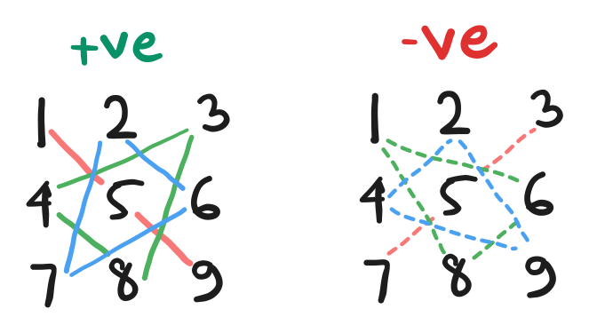
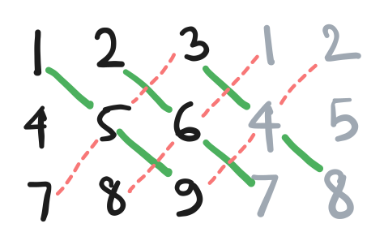
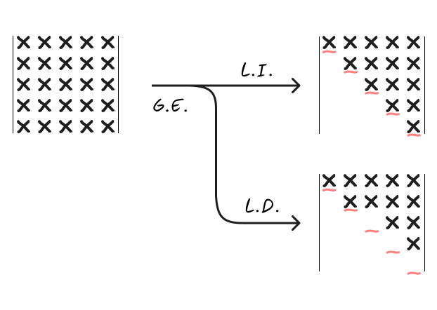
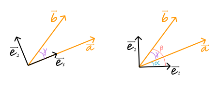

## 1. Why determinants?

- Determinants are a means to an end.
- Only applies to square matrices.
- A single number that tells us about the matrix.
  + An important thing it tells us is whether the matrix is __singular__ (meaning rows or columns are linearly dependent).


---

## 2. Derivation of the $2\times 2$ Determinant

$$
\begin{align*}
\mathbf{A} &= \begin{bmatrix}
a & b\\
c & d
\end{bmatrix} \\
\mathbf{|A|} &= ad - bc
\end{align*}
$$

---

## 3. Interesting $2\times 2$ Determinants

$$
\begin{align*}
\mathbf{A} &= \begin{bmatrix}
\cos(\theta) & -\sin(\theta)\\
\sin(\theta) & \cos(\theta)
\end{bmatrix} \\
\mathbf{|A|} &= \cos(\theta)\cos(\theta) - (-\sin(\theta)\sin(\theta)) \\
&= \cos^2(\theta) + \sin^2(\theta) \\
&= 1
\end{align*}
$$

---

## 4. Derivation of the $3\times 3$ Determinant

Perform gaussian elimination to make the first column $(a, 0, 0)$.

$$
\begin{align*}
\mathbf{A} &= \begin{bmatrix}
a & b & c\\
d & e & f\\
g & h & i
\end{bmatrix} \\
\implies
\begin{bmatrix}
1 & 0 & 0\\
-\frac{d}{a} & 1 & 0\\
-\frac{g}{a} & 0 & 1
\end{bmatrix}\mathbf{A} &= \begin{bmatrix}
a & b & c\\
0 & e - \frac{db}{a} & f - \frac{dc}{a}\\
0 & h - \frac{gb}{a} & i - \frac{gc}{a}
\end{bmatrix} \\
\mathbf{|A|} &= a(ei - fh) - b(di - fg) + c(dh - eg)
\end{align*}
$$

---

## 6. Calculating $3\times 3$ Determinant : The Russian Way

$$
\begin{align*}
\mathbf{A} &= \begin{bmatrix}
1 & 2 & 3\\
4 & 5 & 6\\
7 & 8 & 9
\end{bmatrix} \\
$$



---

## 7. Calculating $3\times 3$ Determinant : The American Way



---

## 8. Calculating $3\times 3$ Determinant : The Indian Way

- Single out a row
- For each entry in the row, cross out the corresponding row and column and calculate the determinant of the remaining matrix.
- There is alternating sign:

$$
\begin{align*}
\mathbf{A} &= \begin{bmatrix}
1 & 2 & 3\\
4 & 5 & 6\\
7 & 8 & 9
\end{bmatrix} \\
\mathbf{|A|} &= 1\begin{vmatrix}
5 & 6\\
8 & 9
\end{vmatrix} - 2\begin{vmatrix}
4 & 6\\
7 & 9
\end{vmatrix} + 3\begin{vmatrix}
4 & 5\\
7 & 8
\end{vmatrix}
\end{align*}
$$

---

## 9. Setting the stage for the $N\times N$ Determinant

- There are $N!$ different terms in the $N\times N$ determinant.
- Even the computer can't handle the $N\times N$ determinant in the complelety expanded form.

---

## 10. Overview of the Properties of the Determinant

- Determinant is called poly-linear because it is not linear on the whole matrix itself, but on each of the rows or columns.

- __We are poetically inspired by what we see in 2 or 3 dimensions and metaphorically extended to higher dimensions.__ - Prof. Pavel Grinfeld
  + These kinds of things always happen in applied mathematics, and linear algebra is always at the center of there kind of extensions.

---

## 13. The Direct Algebraic Definition of the Determinant

$$
|\mathbf{A}| = \sum_{\epsilon \in S_N} \text{sgn}(\epsilon) a_{1\epsilon(1)}a_{2\epsilon(2)}\ldots a_{N\epsilon(N)}, \quad \text{where } S_N \text{ is the set of all permutations of } N
$$

The sign is the parity of the permutation. The parity of the permutation is the minimum number of swaps required to convert the permutation to the identity permutation.

---

## 14. The Transpose Property of the Determinant

The only outstanding question is the sign - the algebraic definition treats rows and columns equally.

$\epsilon$ represents a permutation of the indices.

- The sign is the parity of both of these 2 folks:
  + The number of inversions in the permutation. An inversion is a pair of indices $(i, j)$ such that $i < j$ and $\epsilon(i) > \epsilon(j)$.
  + The minimum number of swaps required to convert the permutation to the identity permutation. This can be found by counting the number of cycles in the permutation.
    - A cycle is a set of indices $(i_1, i_2, \ldots, i_k)$ such that $\epsilon(i_1) = i_2, \epsilon(i_2) = i_3, \ldots, \epsilon(i_k) = i_1$.
- After transposing, each term in the algebraic expression converts to its inverse.


- The sign of the permutation is the same as the sign of the inverse of the permutation. [Run the code to see this in action](../code/determinantPermutation.py).

```ruby
permutation and its inverse: 
idx:  1  2  3  4  5 
val:  2  3  5  4  1 

idx:  1  2  3  4  5 
val:  5  1  2  4  3 
number of inversions in the permutation: 5
number of inversions in the inverse permutation: 5
sign of permutation: -1
sign of inverse permutation: -1
minimum number of swaps to sort the permutation: 3
minimum number of swaps to sort the inverse permutation: 3
```

Hence, each term remains the same after transposing including the sign.
So:

$$
|\mathbf{A}| = |\mathbf{A}^T|\text{\;\;(1)}
$$

---

## 15. The Determinant of a Triangular Matrix

We have no option but to select the diagonal elements, taking any other element any point of time will either:
- Make the product zero.
- Will be invalid, because it will repeat a taken column.

Hence:

$$
\begin{align*}
\mathbf{A} &= \begin{bmatrix}
a_{11} & 0       & 0      & \cdots & 0\\[6pt]
a_{21} & a_{22}  & 0      & \cdots & 0\\[6pt]
a_{31} & a_{32}  & a_{33} & \cdots & 0\\[6pt]
\vdots & \vdots  & \vdots & \ddots & \vdots\\[6pt]
a_{N1} & a_{N2}  & a_{N3} & \cdots & a_{NN}
\end{bmatrix} \\
\quad\\
|\mathbf{A}| &= a_{11}a_{22}a_{33}\ldots a_{NN} \text{\;\;(2)}
\end{align*}
$$

The upper triangular matrix also follows the same rule because it's the transpose of the lower triangular matrix, and $|\mathbf{A}| = |\mathbf{A}^T|$.

The identity matrix is a special case of the triangular matrix, and the determinant is 1.

$$
|\mathbf{I}| = 1\text{\;\;(3)}
$$

---

## 16. The Alternating Property of the Determinant (Transposition)

When we switch two columns, the determinant changes sign.

Proof:

When we switch two columns:
- Each term in the determinant has two indices which trade places.
- Every switch alters the sign of a term in the determinant.
- Hence all of the terms in the determinant change sign.

$$
|\dots a \dots b \dots| = -|\dots b \dots a \dots| \text{\;\;(4)}
$$

What's the determinant of this matrix?

$$
\begin{vmatrix}
3 &&& \\
2 &&& 1 \\
3 && 2 & 3 \\
4 & -6 & 1 & 13
\end{vmatrix}
$$

This is one switch away from a triangular matrix. Hence, determinant is $-(3 \times 1  \times 2  \times -6) = 36$.

Corollary: The determinant of a matrix with two identical columns is zero. Because the only value which is it's negative is 0.

$$
|\dots a \dots a \dots| = 0 \text{\;\;(5)}
$$

---

## 17. The Linear Property of the Determinant

Statement:

$$
|\dots \alpha a + \beta b \dots| = \alpha|\dots a \dots| + \beta|\dots b \dots| \text{\;\;(6)}
$$

Proof looks too much symbols and daunting, but it's basic maths.

Expanding the determinant using the standard permutation definition:

$$
\begin{aligned}
\begin{vmatrix}
\alpha a_{1,1} + \beta b_{1,1} & \alpha a_{1,2} + \beta b_{1,2} & \cdots & \alpha a_{1,N} + \beta b_{1,N}\\
a_{2,1} & a_{2,2} & \cdots & a_{2,N}\\
\vdots & \vdots & \ddots & \vdots\\
a_{N,1} & a_{N,2} & \cdots & a_{N,N}
\end{vmatrix}
&=
\sum_{\sigma \in S_N} \operatorname{sgn}(\sigma) (\alpha a_{1, \sigma(1)} + \beta b_{1, \sigma(1)}) a_{2, \sigma(2)} \cdots a_{N, \sigma(N)} \\
&=
\sum_{\sigma \in S_N} \operatorname{sgn}(\sigma) \left[ \alpha a_{1, \sigma(1)} a_{2, \sigma(2)} \cdots a_{N, \sigma(N)}
+ \beta b_{1, \sigma(1)} a_{2, \sigma(2)} \cdots a_{N, \sigma(N)} \right] \\
&=
\alpha \sum_{\sigma \in S_N} \operatorname{sgn}(\sigma) a_{1, \sigma(1)} a_{2, \sigma(2)} \cdots a_{N, \sigma(N)}
+ \beta \sum_{\sigma \in S_N} \operatorname{sgn}(\sigma) b_{1, \sigma(1)} a_{2, \sigma(2)} \cdots a_{N, \sigma(N)} \\
&=
\alpha
\begin{vmatrix}
a_{1,1} & a_{1,2} & \cdots & a_{1,N}\\
a_{2,1} & a_{2,2} & \cdots & a_{2,N}\\
\vdots & \vdots & \ddots & \vdots\\
a_{N,1} & a_{N,2} & \cdots & a_{N,N}
\end{vmatrix}
+
\beta
\begin{vmatrix}
b_{1,1} & b_{1,2} & \cdots & b_{1,N}\\
a_{2,1} & a_{2,2} & \cdots & a_{2,N}\\
\vdots & \vdots & \ddots & \vdots\\
a_{N,1} & a_{N,2} & \cdots & a_{N,N}
\end{vmatrix}.
\end{aligned}
$$


---

## 18. The effect of Adding a Multiple of One Row to Another

Statement:

$$
|\dots a + \lambda b \dots b \dots | = |\dots a \dots b \dots| \text{\;\;(7)}
$$

Proof:

$$
\begin{align*}
\begin{vmatrix}
a_1 + \lambda b_1 & a_2 + \lambda b_2 & \cdots & a_N + \lambda b_N\\
b_1 & b_2 & \cdots & b_N\\
c_1 & c_2 & \cdots & c_N\\
\vdots & \vdots & \ddots & \vdots\\
d_1 & d_2 & \cdots & d_N
\end{vmatrix} &= \sum_{\epsilon \in S_N} \text{sgn}(\epsilon) (a_{1\epsilon(1)} + \lambda b_{1\epsilon(1)})(c_{2\epsilon(2)})\ldots(d_{N\epsilon(N)})\\
&= \sum_{\epsilon \in S_N} \text{sgn}(\epsilon) a_{1\epsilon(1)}c_{2\epsilon(2)}\ldots d_{N\epsilon(N)} + \lambda\sum_{\epsilon \in S_N} \text{sgn}(\epsilon) b_{1\epsilon(1)}b_{1\epsilon(1)}c_{2\epsilon(2)}\ldots d_{N\epsilon(N)}\\
&= |\dots a \dots b \dots | + \lambda|\dots b \dots b \dots| = |\dots a \dots|
\end{align*}
$$

---

## 19. Calculation of the Determinant by Gaussian Elimination

$$
\begin{vmatrix}
1 & 1 & 4 & 1 \\
2 & 2 & 10 & 6 \\
3 & 9 & 21 & 17 \\
5 & 11 & 29 & 23
\end{vmatrix}
=
\begin{vmatrix}
1 & 1 & 4 & 1 \\
0 & 0 & 2 & 4 \\
0 & 6 & 9 & 14 \\
0 & 6 & 9 & 18
\end{vmatrix}
=
-\begin{vmatrix}
1 & 1 & 4 & 1 \\
0 & 6 & 9 & 14 \\
0 & 0 & 2 & 4 \\
0 & 6 & 9 & 18
\end{vmatrix}
=
-\begin{vmatrix}
1 & 1 & 4 & 1 \\
0 & 6 & 9 & 14 \\
0 & 0 & 2 & 4 \\
0 & 0 & 0 & 4
\end{vmatrix}
=
-(1 \times 6 \times 2 \times 4)
=
-48
$$


---

## 20. The Determinant is Zero $\iff$ The Matrix is Singular

Statement:

$$
|\mathbf{A}| = 0 \iff \mathbf{A} \text{ is singular} \text{\;\;(8)}
$$

Proof:

Gaussian elimination preserves the correctness of each of theses statements:
- $\mathbf{A}$ is singular
  + Gaussian elimination preserves the null space of the matrix.
- $|\mathbf{A}| = 0$
  + Row swapping changes the sign of the determinant.
  + Scaling a row scales the determinant.
  + Adding a multiple of one row to another does not change the determinant.
  + So we see G.E. cannot change determinant value from 0 to non-zero or vice-versa.

At the end of G.E., we can have two patterns:



---

## 21. An Elegant Approach to Defining the Determinant

$$
\begin{cases}
|\mathbf{I}| = 1\text{\;\;(3)} \\
Alternating \text{\;\;(4)} \\
Linear \text{\;\;(6)}
\end{cases}
$$

From the above properties, we can derive the algebraic definition of the determinant. There can be no other alternative expression for the determinant.

Suppose we have a $N \times N$ matrix $\mathbf{A}$. These are steps we follow to calculate the determinant:

- We split each column into $N$ columns using the __linear property__. Each of the column has non-zero entry at the respective row and zero elsewhere.

$$
\begin{align*}
|\mathbf{A}| &=
\begin{vmatrix}
a_{11} & a_{12} & \cdots & a_{1N}\\
a_{21} & a_{22} & \cdots & a_{2N}\\
\vdots & \vdots & \ddots & \vdots\\
a_{N1} & a_{N2} & \cdots & a_{NN}
\end{vmatrix} \\
&= 
\begin{vmatrix}
a_{11} & a_{12} & \cdots & a_{1N}\\
0 & a_{22} & \cdots & a_{2N}\\
\vdots & \vdots & \ddots & \vdots\\
0 & a_{N2} & \cdots & a_{NN}
\end{vmatrix} +
\begin{vmatrix}
0 & a_{12} & \cdots & a_{1N}\\
a_{21} & a_{22} & \cdots & a_{2N}\\
\vdots & \vdots & \ddots & \vdots\\
0 & a_{N2} & \cdots & a_{NN}
\end{vmatrix} + \ldots +
\begin{vmatrix}
0 & a_{12} & \cdots & a_{1N}\\
0 & a_{22} & \cdots & a_{2N}\\
\vdots & \vdots & \ddots & \vdots\\
a_{N1} & a_{N2} & \cdots & a_{NN}
\end{vmatrix}
\end{align*}
$$

- This is repeated for each of the $N$ columns. Now we have $N^N$ determinant terms. Each coulmn in each of the terms has a single non-zero entry (or a _need not be zero_ expression to be more precise).
- We now factor out the coefficients outside the matrix using the __linear property__. Hence each of the $N^N$ terms will be multiplied by the corresponding coefficients factored out, and the matrix will contain $1s$ and $0s$.
- Some of $N^N$ terms will have repeating columns. By the __alternating property__, these terms will be zero.
- At the end, only those terms will be left each of which has $1$ in unique row positions in each of the columns. There will be $N!$ such terms, because there are $N!$ ways to choose the ordered tuple of the row index for each of the columns.
- Each of these terms are some permutation of the identity matrix. By doing the reverse of the permutation we can reach the identity matrix (using the __alternating property__), and spit out some power of $-1$ out of the determinant.
- The total number of $-1$ which comes out is the parity of the inverse permutation. This is the definition of the sign of the permutation.
- At the end we have $N!$ terms with some expression outside multiplied with the identity matrix.
- Using the __identity property__ $|I| = 1$, we are just left with the coeffients and the sign for each of the permutation terms.

---

## 22. Calculation of Areas and Volumes by the Determinant

$$
\begin{cases}
|\mathbf{I}| = 1\text{\;\;(3)}\\
Alternating \text{\;\;(4)}\\
Linear \text{\;\;(6)}
\end{cases}
$$

The ordered tuple of the unit vectors in each of the dimentions form the basis, and comprise the identity matrix. The area or volume created by this shape is 1. Hence, the __identity property__ is satisfied. ($|I| = 1$)


> [!NOTE]
> We don't need cartesian coordinates. All we need is a coordinate basis definition such the signed area of the parallelogram or the signed volume of the parallelepiped is 1.

Signed area or signed volume changes sign when we reorded the basis vectors. Hence, the __alternating property__ is satisfied.

Now, let's talk about a parallelogram or a parallelepiped with these basis vectors.

If we cale a side of the parallelogram by a factor of $\alpha$, the area of the parallelogram will be $\alpha$ times the original area. Hence, part 1 of the __linear property__ is satisfied.

We can also show visually that when a a side is written as the sum of two other sides, the area of the parallelogram is the sum of the areas of the two parallelograms formed by the two sides. Hence, part 2 of the __linear property__ is satisfied.

_Since all __the three properties of the determinant__ are satisfied by the signed area of the parallelogram or the signed volume of the parallelepiped, this __can be nothing but the determinant__ of the matrix formed by the basis vectors._

[TinkerCAD link for sample parallelopiped  decomposition](https://www.tinkercad.com/things/hJWM0Ekmh7F-volume-of-parallelepiped-decomposition?sharecode=yCUAZk0cx-CDiRvyWkBpvSjCw47e6Vph2-vki2r1JsQ)

---

## 23. Determinant based derivation of the Triangle Area Formula

Area of a triangle with sides $a, b$ and angle $\gamma$ between them is $\frac{1}{2}ab\sin(\gamma)$.

Let's consider 2 cases. In one case, our choice of basis is smart, and we choose one basis vector along the side $a$.



Case 1: Basis vector along the side $a$.

$$
\begin{align*}
\text{Area} &= \frac{1}{2}
\begin{vmatrix}
a & b \cos(\gamma)\\
0 & b \sin(\gamma)
\end{vmatrix} \\
&= \frac{1}{2}a b \sin(\gamma)
\end{align*}
$$

Case 2: Generic basis vector.

$$
\begin{align*}
\text{Area} &= \frac{1}{2}
\begin{vmatrix}
a \cos(\alpha) & b \cos(\beta)\\
a \sin(\alpha) & b \sin(\beta)
\end{vmatrix} \\
&= \frac{1}{2}ab(\cos(\alpha)\sin(\beta) - \sin(\alpha)\cos(\beta)) \\
&= \frac{1}{2}ab\sin(\beta - \alpha) \\
&= \frac{1}{2}ab\sin(\gamma)
\end{align*}
$$

---

## 24. Area of a triangle as a function of its Cartesian coordinates

If the cooredinates of the vertices of the triangle are $(x_1, y_1), (x_2, y_2), (x_3, y_3)$, then the area of the triangle is:

$$
\text{Area} = \frac{1}{2}
\begin{vmatrix}
(x_2 - x_1) & (x_3 - x_1)\\
(y_2 - y_1) & (y_3 - y_1)
\end{vmatrix}
$$

This can be elegantly expressed as:

$$
\text{Area} = \frac{1}{2}
\begin{vmatrix}
1 & x_1 & y_1\\
1 & x_2 & y_2\\
1 & x_3 & y_3
\end{vmatrix}
$$

In neighbouring numerical analysis (what is that? 🤨), this matrix is quite useful. There's some technique called finite element method.

Signed area of the tetrahedron is also similar. I's 1/6 times the area of the corresponding parallelepiped.

$$
\text{Volume} = \frac{1}{6}
\begin{vmatrix}
1 & x_1 & y_1 & z_1\\
1 & x_2 & y_2 & z_2\\
1 & x_3 & y_3 & z_3\\
1 & x_4 & y_4 & z_4
\end{vmatrix}
$$

---

## 25. An application of the product property of the Determinant

$$
|\mathbf{A}\mathbf{B}| = |\mathbf{A}||\mathbf{B}| \text{\;\;(9)}
$$

This we'll prove later, for now, we can assume this is true, and verify the effect of some linear operation to the matrix on its determinant. For each sample linear operation, you can create a transformation matrix (elementatry matrix) and verify it.

__TODO: Do some elementary matrix exercises again!__

---

## 26. Product Property of the Determinant - Proof for Elementary Matrices

We show for elementary matrices $\mathbf{E}$, the determinant is multiplicative:

$$
|\mathbf{EA}| = |\mathbf{E}||\mathbf{A}|
$$

---

## 27. Complete proof of the product property of the Determinant

We've seen for elementary matrices $\mathbf{E}$, the determinant is multiplicative:

$$
|\mathbf{EA}| = |\mathbf{E}||\mathbf{A}| \text{where } \mathbf{E} \text{ is an elementary matrix}
$$

We know that any non-singular matrix can be written as a product of elementary matrices:

$$
\mathbf{A} = \mathbf{E}_1\mathbf{E}_2\ldots\mathbf{E}_n
$$

Hence, we can write:

$$
\begin{align*}
|\mathbf{AB}| &= |\mathbf{E}_1\mathbf{E}_2\ldots\mathbf{E}_{n_1}\mathbf{E}_n\mathbf{B}| \\
&= |\mathbf{E}_1\mathbf{E}_2\ldots\mathbf{E}_{n-1}\mathbf{E}_n\mathbf{B}| \\
&\quad \dots\text{we break from left to right using above property} \\
&= |\mathbf{E}_1||\mathbf{E}_2\ldots\mathbf{E}_n\mathbf{B}| \\
&= |\mathbf{E}_1||\mathbf{E}_2|\ldots|\mathbf{E}_{n-1}||\mathbf{E}_n||\mathbf{B}| \\
&\quad \dots\text{we accumulate from right to left using above property} \\
&= |\mathbf{E}_1||\mathbf{E}_2|\ldots|\mathbf{E}_{n-1}\mathbf{E}_n||\mathbf{B}|\\
&= |\mathbf{E}_1\mathbf{E}_2\ldots\mathbf{E}_{n-1}|\mathbf{B}| \\
&= |\mathbf{A}||\mathbf{B}|
\end{align*}
$$

For singular matrix, the statement is trivially true because the determinant is zero.

---

## 28. Row or Column Expansion of the Determinant by Cofactors (or Minors)

This is also called the Laplace expansion.

$$
\begin{align*}
\mathbf{A} &= \begin{bmatrix}
a & b & c\\
d & e & f\\
g & h & i
\end{bmatrix} \\
|\mathbf{A}| &= a\begin{vmatrix}
e & f\\
h & i
\end{vmatrix} - b\begin{vmatrix}
d & f\\
g & i
\end{vmatrix} + c\begin{vmatrix}
d & e\\
g & h
\end{vmatrix}
\end{align*}
$$

We can use any row or any column to expand the determinant. The initial sign will vary based on the row or column chosen. It follows the checkerboard pattern.

$$
\begin{vmatrix}
+ & - & + & - & + \\
- & + & - & + & - \\
+ & - & + & - & + \\
- & + & - & + & - \\
+ & - & + & - & +
\end{vmatrix}
$$

Another way to remember is that the sign of every entry in a cofactor is predetermined by the row and column index of the entry.

$$
\operatorname{sgn}(a_{ij}) = (-1)^{i+j}
$$

