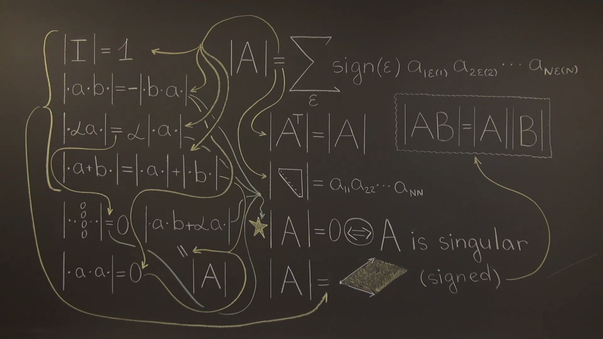

## 1. Why determinants?

- Determinants are a means to an end.
- Only applies to square matrices.
- A single number that tells us about the matrix.
  + An important thing it tells us is whether the matrix is __singular__ (meaning rows or columns are linearly dependent).

---

